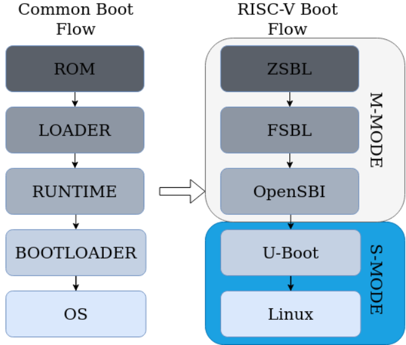
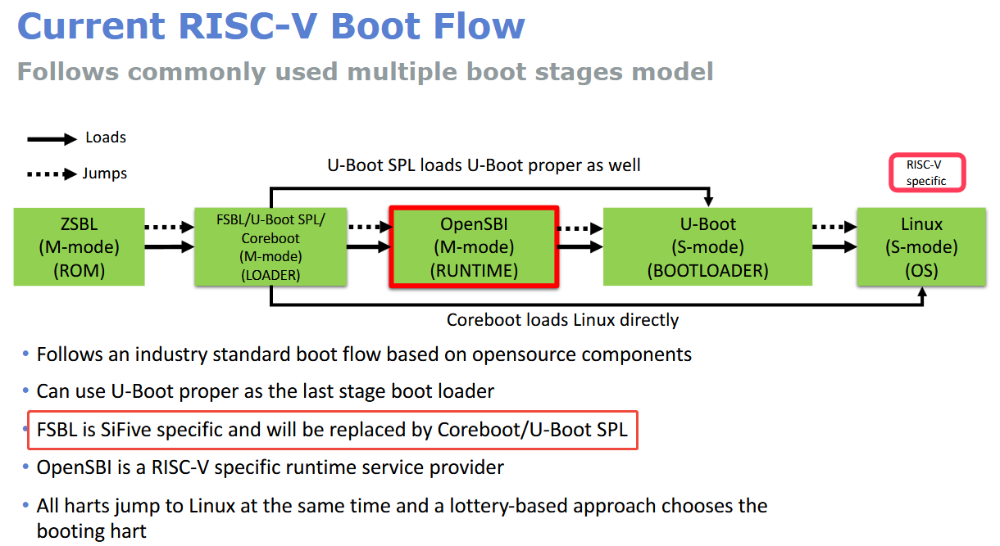

# 关于通用的启动流程和RISV的启动流程

Before any operating system can start, a boot flow with numerous boot stages must commit a set of system requirements. Any embedded system will always have a multistage boot flow , with each stage devoted to a specific set of tasks. 

A typical boot sequence is represented in Figure 2.7, where the first stage is referred to as the:

 **(i) Zero-Stage Boot Loader (ZSBL) or the ROM** since it **operates on the ROM**. **It initializes clocks, manages system power, and resets the system**. After the voltages have steadied and the hardware is ready to begin booting, the processor initializes the hardware buses and peripherals. 

It is the initial code run by the CPU, and it embeds all of the logic required for the following boot stage through external peripherals such as an embedded Multi-Media Card (eMMC), microSD card, or even via specialized protocols on a bus for data transfer (like USB, UART, and others). 

Nextly has presented the **(ii) LOADER, commonly known as the First-Stage Boot Loader (FSBL)**. **It initializes the DDRs** and loads the subsequent stages, including the RUNTIME stage. Though the FSBL does not need regular updates, any change may result in unexpected behavior and could jeopardize the board. 

The **(iii) RUNTIME stage** executes all safe boot flow components **on top of the on-chip Static Random Access Memory (SRAM)**, and it is assumed to be the second stage boot loader. Software layers such as U-Boot , and OpenSBI may commit to this, as well as being responsible to provides runtime  services to the OSs following system boot.

>  Runtime services: It translates as runtime services to all the communication services that lower privilege layers do to higher privilege layers. Typically, they are carried out in S-mode using the previously stated ECall instructions through an SBI layer.

The penultimate boot stage contains the **(iv) BOOTLOADER,** which **loads kernel images** from media like SD cards or networks. Grub  is an example of a software bootloader capable of loading Linux kernel images from Multi-Media Card (MMC) devices. 

**The last step introduces the (v) OS**, which typically operates in S-mode and handles all non-privileged applications. Regarding all boot stages, this dissertation will focus on the RUNTIME boot stage, where OpenSBI operates in M-mode and provide services to lower privilege levels, as seen in Figure 2.7, where it supports both U-Boot and Linux OS running in S-mode.

| 通用       | 功能/备注                                                    | 是否可以使用DRAM                   | riscv   | 功能/备注 |
| ---------- | ------------------------------------------------------------ | ---------------------------------- | ------- | --------- |
| ROM        | 初始化硬件信息例如时钟频率，电压等，具体见[这里](./mask-rom.md) | 此时仅可以使用SRAM，DRAM尚未初始化 | ZSBL    |           |
| loader     | 初始化内存                                                   | 前期用 SRAM，后期启用 DRAM         | FSBL    |           |
| runtime    | 在SRAM上执行，提供一个抽象层                                 | 可以                               | openSBI |           |
| bootloader |                                                              | 可以                               | U-Boot  |           |
| OS         |                                                              | 可以                               | Linux   |           |

> **SRAM**：芯片内置小高速内存，**DDR 没起来之前全程靠它**（Mask ROM、SPL 初期）
>
> **DRAM（就是常说的系统内存 RAM/DDR）**：大容量外接内存，**SPL 初始化 DDR 后，U-Boot 和 Linux 全跑在这里**

> 1. **DRAM/DDR 未初始化前，芯片上电重启阶段，唯一能直接读写、可当做程序运行栈 / 全局变量 / 临时数据的运行时内存，只有片内 SRAM**。
>
> 2. **Flash、ROM、OTP/eFuse 全都不能当作运行内存**，只能读、不能高速随机读写、不能直接跑代码、不能当栈用。
>
> 3. 除此以外几乎**无其他通用运行内存**，极少数芯片自带极小片内 ROM 可临时用，但不属于可读写内存范畴

## 参考

* [HSP-V: Holistic Static Partitioning on RISC-V Platforms](https://www.researchgate.net/publication/362293125_HSP-V_Holistic_Static_Partitioning_on_RISC-V_Platforms)
* [RISC-V bootflow: What’s next ?](https://archive.fosdem.org/2020/schedule/event/riscv_bootflow/attachments/slides/4205/export/events/attachments/riscv_bootflow/slides/4205/FOSDEM_2020_Atish.pdf)

# Mask ROM / Flash / SRAM / DDR 对照

| 器件         | 本质类型     | 可否擦写         | 位置                           | 容量           | 核心作用                                         | 启动阶段用到时机                                             |
| ------------ | ------------ | ---------------- | ------------------------------ | -------------- | ------------------------------------------------ | ------------------------------------------------------------ |
| **Mask ROM** | 只读固化 ROM | ❌ 出厂永久不可改 | 芯片**片内**                   | 很小 KB 级     | 上电第一条指令、固化第一级启动代码               | **上电最先执行**，整个启动链起点                             |
| **Flash**    | 闪存         | ✅                | 大多**片外**（也有片内 Flash） | 大 MB/GB 级    | 存放 SPL、U-Boot、设备树、Linux 内核、文件系统   | Mask ROM/SPL 从中**加载程序**到内存                          |
| **SRAM**     | 内存         | ✅                | 芯片**片内集成**               | 小 KB~ 几百 KB | 极速临时内存、栈、缓存、DDR 未就绪前唯一可用内存 | Mask ROM、SPL**前期全程依赖**；DDR 初始化前专用              |
| **DDR**      | 内存         | ✅                | 芯片**外接**颗粒               | 超大 GB 级     | 系统主内存、运行 U-Boot/OpenSBI/Linux 内核       | SPL**初始化 DDR 之后**，所有后续程序全跑在这里，起始地址默认 **0x80000000** |

