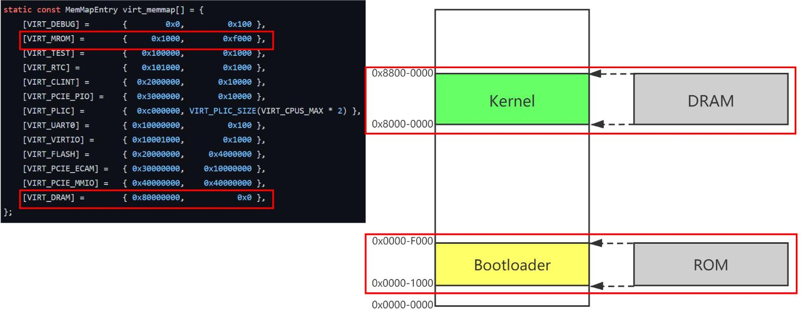

# 编写第一个汇编程序，使其运行在QEMU模拟的RISCV裸机上

完整代码见：https://github.com/youth7/write_rvos_with_c_in_n_days/tree/day1

## 编写程序

编写一个简单的程序（`loop.s`），它的唯一功能就是不断对`a0`的值加1

```assembly
.global _start
_start:
	addi a0, a0, 1
	j _start

```

* 注意最后必须换行，否则会报一个警告：`Warning: end of file not at end of a line; newline inserted`
* 同时必须定义全局符号`_start`，原因见[这里](../../others/ld/ld.md)

## 编译

编译上述文件，得到`start.elf`

```bash
riscv64-unknown-elf-gcc -nostdlib -fno-builtin -march=rv32g -mabi=ilp32 -g -Wall -Ttext=0x80000000 loop.s  -o start.elf 
riscv64-unknown-elf-objcopy -O binary start.elf start.bin
# 顺便生成bin文件，等下会用到
```

关于gcc中和链接相关的选项，以及ld自身的选项，请参考[这里](../../others/ld/ld.md)


### `-nostdlib`

这是一个gcc中和链接相关的选项：

> Do not use the **standard system startup files or libraries** when linking......

启动文件（Startup File）是嵌入式系统开发中的核心组件之一，它用于初始化系统并为主程序的运行做好准备。在大多数情况下，启动文件是用汇编语言编写的，并且与具体的处理器架构和工具链紧密相关。具体参考[这里](https://zhuanlan.zhihu.com/p/12989475903)


### `-fno-builtin`

gcc中和C相关的选项，简单来说即告诉编译器要保持函数的调用方式，不要使用built-in（gcc内部的魔改）版本。

> ```
> -fno-builtin
> -fno-builtin-function
> ```
>
> Don’t recognize built-in functions that do not begin with ‘__builtin_’ as prefix.  See [Builtins for C Library Functions](https://gcc.gnu.org/onlinedocs/gcc/Library-Builtins.html), for details of the functions affected, including those which are not built-in functions when -ansi or -std options for strict ISO C conformance are used because they do not have an ISO standard meaning.
>
> **GCC normally generates special code to handle certain built-in functions more efficiently**; for instance, calls to `alloca` may become single instructions which adjust the stack directly, and calls to `memcpy` may become inline copy loops.  The resulting code is often both smaller and faster, but since the function calls no longer appear as such, **you cannot set a breakpoint on those calls, nor can you change the behavior of the functions by linking with a different library**.  
>
> In addition, **when a function is recognized as a built-in function**, GCC may use information about that function to warn about problems with calls to that function, or to generate more efficient code, even if the resulting code still contains calls to that function.  For example, warnings are given with -Wformat for bad calls to `printf` when `printf` is built in and `strlen` is known not to modify global memory.（即使用了built-in function之后，能够提供更多的警告信息？）
>
> With the -fno-builtin-function option only the built-in function is disabled.  function must not begin with ‘__builtin_’.  If a function is named that is not built-in in this version of GCC, this option is ignored.  There is no corresponding -fbuiltin-function option; if you wish to enable built-in functions selectively when using -fno-builtin or -ffreestanding, you may define macros such as:
>
> ```
> #define abs(n)          __builtin_abs ((n))
> #define strcpy(d, s)    __builtin_strcpy ((d), (s))
> ```
>

具体的解读可参考[这里](https://stackoverflow.com/questions/54281780/what-exactly-is-fno-builtin-doing-here)


### `-Ttext`

> ```
> -Ttext=org
> ```
>
> Same as --section-start, with `.bss`, `.data` or `.text` as the sectionname.
>
> 
>
>  ```
> --section-start=sectionname=org
>  ```
>
>  Locate a section in the output file at the absolute address given by `org`.  You may use this option as many times as necessary to locate multiple sections in the command line. `org` must be a single hexadecimal integer; for compatibility with other linkers, you may omit the leading ‘0x’ usually associated with hexadecimal values.  *Note:* there should be no white space between `sectionname`, the equals sign (“=”), and `org`.
>

`-Ttext=0x80000000`非常重要，如果缺少这个选项，编译器会为`_start`函数生成另外一个地址值：

```bash
# 不加-Ttext=0x80000000参数
readelf -s  start.elf  | grep start
    13: 00010074     0 NOTYPE  GLOBAL DEFAULT    1 _start
    15: 0001107c     0 NOTYPE  GLOBAL DEFAULT    1 __bss_start
    
# 加-Ttext=0x80000000参
readelf -s  start.elf  | grep start
    13: 80000000     0 NOTYPE  GLOBAL DEFAULT    1 _start
    15: 80001008     0 NOTYPE  GLOBAL DEFAULT    1 __bss_start    
    
```

如果在这个地址上设置断点，则QEMU会报错：`Cannot access memory at address 0x10074`。从QEMU的[源文件](https://github.com/qemu/qemu/blob/master/hw/riscv/virt.c)来看：

```c
static const MemMapEntry virt_memmap[] = {
    [VIRT_DEBUG] =        {        0x0,         0x100 },
    [VIRT_MROM] =         {     0x1000,        0xf000 },
    [VIRT_TEST] =         {   0x100000,        0x1000 },
  ...
};
```

地址`0x00010074`属于`VIRT_TEST`，这个区域的内存应该是不能被直接访问的。

其实这里需要注意两个问题，不要混淆它们：

1. 编译时的内存布局：即编译时，compiler以程序运行时的内存布局来确定各个符号的值。

2. 加载阶段的内存布局：必须把ELF文件加载到适合的位置，满足编译时的地址约束。


GCC和Qemu都以0x80000000为起始地址地址，这是因为该地址是 RISC-V 生态的 “约定俗成”—— 硬件厂商、模拟器（如 QEMU）、编译器（如 GCC）都遵循该标准，确保软件能在不同平台上兼容运行。

但奇怪的是，在**[SiFive FE310 芯片数据手册](https://www.starfivetech.com/uploads/fe310-g000-manual-v3p2.pdf)（RISC-V 32 位参考硬件）**中，似乎并没有明确说明这点。**第 4.3 节 Memory Map**中，地址段`0x80000000`~`0x80003FFF`的描述是DTIM（Data Tightly Integrated Memory）。问了下大模型，大致意思是：

> 总结逻辑闭环：
>
> 1. FE310 硬件中，`0x80000000` 是 DTIM（片上核心内存）的起始地址；
> 2. FE310 的 Boot ROM 引导程序，默认将用户程序复制到 DTIM（0x80000000）并跳转执行；
> 3. RISC-V 生态（包括 QEMU）采纳该地址作为 “32 位系统的默认加载 / 执行地址”，确保软件兼容；
> 4. QEMU 的 `virt` 机器简化了 Boot ROM 流程，直接将 `-kernel` 镜像加载到该标准地址，同时扩展内存大小以适配实际使用场景。
>
> 简单说：QEMU 加载到 `0x80000000`，是对 FE310 硬件 “DTIM 地址 + Boot 跳转逻辑” 的**生态级兼容**，而非 1:1 复刻硬件，但核心地址约定完全一致。


## 使用QEMU加载并运行

```bash
qemu-system-riscv32 -nographic -smp 1 -machine virt -bios none -kernel start.elf -s -S
```


## QEMU启动阶段





[请看这里](./boot-compare.md)，因为**QEMU 直接跳过了 Mask ROM→SPL→U-Boot 的完整流程，将用户程序（`start.elf`）直接加载到 `0x8000_0000`，本质是模拟了 “引导流程全部完成后” 的状态，方便开发者调试**。


下面我们来验证这点，在运行上一节的命令之后，QEMU停下来并等待连接调试。我们连接上GDB server，然后观察地址（**Mask Rom的代码，地址为0x1000**）和相关代码：

```bash
riscv64-unknown-elf-gdb -q -ex 'target remote localhost:1234'  -ex 'disassemble 0x1000, +30'  start.elf
```

> * `-q`："Quiet".  Do not print the introductory and copyright messages.
> * `-ex`：Execute given GDB command

会有如下输出：

```bash
Reading symbols from start.elf...
Remote debugging using localhost:1234
warning: Architecture rejected target-supplied description
0x00001000 in ?? ()
Dump of assembler code from 0x1000 to 0x101e:
=> 0x00001000:  auipc   t0,0x0
   0x00001004:  addi    a2,t0,40 # 0x1028
   0x00001008:  csrr    a0,mhartid
   0x0000100c:  lw      a1,32(t0)
   0x00001010:  lw      t0,24(t0)
   0x00001014:  jr      t0
   0x00001018:  unimp
   0x0000101a:  0x8000
   0x0000101c:  unimp
End of assembler dump.
```

这就是第一阶段的启动代码，可以看到最后通过指令`jr t0`进行跳转。对这条指令进行断点，然后看一下寄存器`t0`的值：

```bash
(gdb) b *0x00001014
Breakpoint 1 at 0x1014
(gdb) c
Continuing.

Breakpoint 1, 0x00001014 in ?? ()
(gdb) p /x $t0
$1 = 0x80000000
```

**可以看到第一阶段结束之后，BIOS会将控制权交给位于`0x80000000`的代码，而我们的内核代码必须精确地加载到这个地址**


## 使用GDB进行调试

```bash
riscv64-unknown-elf-gdb -q -ex 'target remote localhost:1234' -ex 'b _start'  -ex 'display/z $$a0'   start.elf
```


## 不调试，直接运行二进制文件

```bash
qemu-system-riscv32 -nographic -smp 1 -machine virt -bios none -kernel start.elf 
```


## 用Makefile来控制上述过程

```makefile

compile: loop.s
	@echo "start to compile..."
	@riscv64-unknown-elf-gcc -nostdlib -fno-builtin -march=rv32g -mabi=ilp32 -g -Wall -Ttext=0x80000000 loop.s  -o start.elf 
	@riscv64-unknown-elf-objcopy -O binary start.elf start.bin	
	@echo "compile done"


debug: compile
	@echo "start to debug..."
	@qemu-system-riscv32 -nographic -smp 1 -machine virt -bios none -kernel start.elf -s -S & 
	@riscv64-unknown-elf-gdb -q -ex 'target remote localhost:1234' -ex 'b _start'  -ex 'display/z $$a0'   start.elf
	@echo "debug done"

run: compile
	@echo "start to run..."
	@qemu-system-riscv32 -nographic -smp 1 -machine virt -bios none -kernel start.elf 
	@echo "run done"

clean:
	@echo "start to clean..."
	@rm -rf start.*
	@echo "clean done"
```

然后运行

```bash
make clean debug
```

