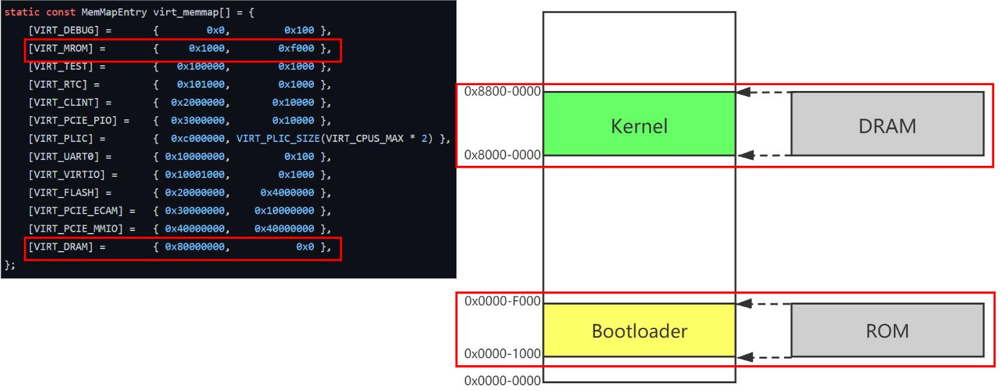

# 编写第一个汇编程序，使其运行在QEMU模拟的RISCV裸机上

完整代码见：https://github.com/youth7/write_rvos_with_c_in_n_days/tree/day1

## 编写程序

编写一个简单的程序（`loop.s`），它的唯一功能就是不断对`a0`的值加1

```assembly
.global _start
_start:
	addi a0, a0, 1
	j _start

```

* 注意最后必须换行，否则会报一个警告：`Warning: end of file not at end of a line; newline inserted`
* 同时必须定义全局符号`_start`，原因见[这里](../../others/ld/ld.md)

## 编译

编译上述文件，得到`start.elf`

```bash
riscv64-unknown-elf-gcc -nostdlib -fno-builtin -march=rv32g -mabi=ilp32 -g -Wall -Ttext=0x80000000 loop.s  -o start.elf 
riscv64-unknown-elf-objcopy -O binary start.elf start.bin
# 顺便生成bin文件，等下会用到
```

关于gcc中和链接相关的选项，以及ld自身的选项，请参考[这里](../../others/ld/ld.md)


### `-nostdlib`

这是一个gcc中和链接相关的选项：

> Do not use the **standard system startup files or libraries** when linking......

启动文件（Startup File）是嵌入式系统开发中的核心组件之一，它用于初始化系统并为主程序的运行做好准备。在大多数情况下，启动文件是用汇编语言编写的，并且与具体的处理器架构和工具链紧密相关。具体参考[这里](https://zhuanlan.zhihu.com/p/12989475903)


### `-fno-builtin`

gcc中和C相关的选项，简单来说即告诉编译器要保持函数的调用方式，不要使用built-in（gcc内部的魔改）版本。

> `-fno-builtin` means that gcc **will not try to replace library functions with builtin compiled code**, and you'll not get any weirdness  due to such replacements. 
>
> I've been bitten by replacements of `printf("%s", mystr)` by `puts(mystr)`, for example - even when I wasn't including `stdio.h` at all!

具体的解读可参考[这里](https://stackoverflow.com/questions/54281780/what-exactly-is-fno-builtin-doing-here)


### `-Ttext`

> ```
> -Ttext=org
> ```
>
> Same as --section-start, with `.bss`, `.data` or `.text` as the sectionname.
>
> 
>
>  ```
> --section-start=sectionname=org
>  ```
>
>  Locate a section in the output file at the absolute address given by `org`.  You may use this option as many times as necessary to locate multiple sections in the command line. `org` must be a single hexadecimal integer; for compatibility with other linkers, you may omit the leading ‘0x’ usually associated with hexadecimal values.  *Note:* there should be no white space between `sectionname`, the equals sign (“=”), and `org`.
>

`-Ttext=0x80000000`非常重要，如果缺少这个选项，编译器会为`_start`函数生成另外一个地址值：

```bash
# 不加-Ttext=0x80000000参数
readelf -s  start.elf  | grep start
    13: 00010074     0 NOTYPE  GLOBAL DEFAULT    1 _start
    15: 0001107c     0 NOTYPE  GLOBAL DEFAULT    1 __bss_start
    
# 加-Ttext=0x80000000参数
readelf -s  start.elf  | grep start
    13: 80000000     0 NOTYPE  GLOBAL DEFAULT    1 _start
    15: 80001008     0 NOTYPE  GLOBAL DEFAULT    1 __bss_start    
    
```

如果在这个地址上设置断点，则QEMU会报错：`Cannot access memory at address 0x10074`。从QEMU的[源文件](https://github.com/qemu/qemu/blob/master/hw/riscv/virt.c)来看：

```c
static const MemMapEntry virt_memmap[] = {
    [VIRT_DEBUG] =        {        0x0,         0x100 },
    [VIRT_MROM] =         {     0x1000,        0xf000 },
    [VIRT_TEST] =         {   0x100000,        0x1000 },
  ...
};
```

地址`0x00010074`属于`VIRT_TEST`，这个区域的内存应该是不能被直接访问的。

其实这里需要注意两个问题，不要混淆它们：

1. 编译时的内存布局：即编译时，compiler以程序运行时的内存布局来确定各个符号的值。
2. 加载阶段的内存布局：必须把ELF文件加载到适合的位置，**满足编译时对地址的期望，使得编译时和运行时的地址视图是一致的（重要：⚠️⚠️⚠️⚠️）**。

即：

> **QEMU：** 我把你的程序放到 **0x80000000**，并且从这里开始执行。
>
> **GCC：** 那我编译链接时，**所有地址都必须按 0x80000000 来计算**。
>
> **结果：** 跳转正确、符号正确、程序能跑。

如果能够实现全程相对跳转，那么理论上可以不需要`-Ttext=0x80000000`，但在实际开发过程中这几乎不可能，因有以下几种情况会把你拖入绝对寻址的状态：

>  **① 访问全局变量**
>
> ```asm
>la a0, msg
> ```
> 
> `la` = 把**绝对地址**加载到寄存器→ 必须知道 msg 存在哪个地址
>
> 
>
>  **② 调用函数（特别 C 语言）**
>
> ```c
>void func() { ... }
> func();
>```
> 
>C 函数调用会生成**绝对地址引用**
> 
>
> 
>**③ 设置栈指针**
> 
>```asm
> li sp, 0x80010000
> ```
> 
> 栈必须放在固定地址
>
> 
>
> **④ 操作设备地址、中断向量、符号**
>
> ```asm
>auipc + ld 这类组合也经常需要固定地址
> ```
>
> 
>
> ⑤ 进入 C 语言
>
> **只要你写一句 C 代码，立即需要绝对地址！**C 语言**天生依赖绝对寻址**。


### 真实硬件的启动流程

在[SiFive FE310 芯片数据手册](https://cdn.sparkfun.com/assets/b/f/a/1/2/FE310-G000.pdf)（RISC-V 32 位参考硬件）**第 4.3 节 Memory Map**中，地址段`0x80000000`~`0x80003FFF`的描述是DTIM（Data Tightly Integrated Memory）。而它的启动流程是这样的：

> 6.2 Reset and Trap Vectors
>
> * FE310-G000 fetches the first instruction out of reset from **0x1000**. （这个地址和QEMU是一致的，因为是Mask Rom的代码，地址为0x1000，见下面GDB调试的例子）
> * The instruction stored there jumps straight to OTP at **0x2_0000**, and will either ：
>   * enter a trap loop if the OTP is not programmed,
>   * or start running the OTP code


## 使用QEMU加载并运行

```bash
qemu-system-riscv32 -nographic -smp 1 -machine virt -bios none -kernel start.elf -s -S
```


## QEMU启动阶段





[请看这里](./boot-compare.md)，因为**QEMU 直接跳过了[Mask ROM](./mask-rom.md)→SPL→U-Boot 的完整流程，将用户程序（`start.elf`）直接加载到 `0x8000_0000`，本质是模拟了 “引导流程全部完成后” 的状态，方便开发者调试**。


下面我们来验证这点，在运行上一节的命令之后，QEMU停下来并等待连接调试。我们连接上GDB server，然后观察地址（**Mask Rom的代码，地址为0x1000**）和相关代码：

```bash
riscv64-unknown-elf-gdb -q -ex 'target remote localhost:1234'  -ex 'disassemble 0x1000, +30'  start.elf
```

> * `-q`："Quiet".  Do not print the introductory and copyright messages.
> * `-ex`：Execute given GDB command

会有如下输出：

```bash
Reading symbols from start.elf...
Remote debugging using localhost:1234
warning: Architecture rejected target-supplied description
0x00001000 in ?? ()
Dump of assembler code from 0x1000 to 0x101e:
=> 0x00001000:  auipc   t0,0x0
   0x00001004:  addi    a2,t0,40 # 0x1028
   0x00001008:  csrr    a0,mhartid
   0x0000100c:  lw      a1,32(t0)
   0x00001010:  lw      t0,24(t0)
   0x00001014:  jr      t0
   0x00001018:  unimp
   0x0000101a:  0x8000
   0x0000101c:  unimp
End of assembler dump.
```

这就是第一阶段的启动代码，可以看到最后通过指令`jr t0`进行跳转。对这条指令进行断点，然后看一下寄存器`t0`的值：

```bash
(gdb) b *0x00001014
Breakpoint 1 at 0x1014
(gdb) c
Continuing.

Breakpoint 1, 0x00001014 in ?? ()
(gdb) p /x $t0
$1 = 0x80000000
```

**可以看到第一阶段结束之后，BIOS会将控制权交给位于`0x80000000`的代码，而我们的内核代码必须精确地加载到这个地址**


## 使用GDB进行调试

```bash
riscv64-unknown-elf-gdb -q -ex 'target remote localhost:1234' -ex 'b _start'  -ex 'display/z $$a0'   start.elf
```


## 不调试，直接运行二进制文件

```bash
qemu-system-riscv32 -nographic -smp 1 -machine virt -bios none -kernel start.elf 
```


## 用Makefile来控制上述过程

```makefile

compile: loop.s
	@echo "start to compile..."
	@riscv64-unknown-elf-gcc -nostdlib -fno-builtin -march=rv32g -mabi=ilp32 -g -Wall -Ttext=0x80000000 loop.s  -o start.elf 
	@riscv64-unknown-elf-objcopy -O binary start.elf start.bin	
	@echo "compile done"


debug: compile
	@echo "start to debug..."
	@qemu-system-riscv32 -nographic -smp 1 -machine virt -bios none -kernel start.elf -s -S & 
	@riscv64-unknown-elf-gdb -q -ex 'target remote localhost:1234' -ex 'b _start'  -ex 'display/z $$a0'   start.elf
	@echo "debug done"

run: compile
	@echo "start to run..."
	@qemu-system-riscv32 -nographic -smp 1 -machine virt -bios none -kernel start.elf 
	@echo "run done"

clean:
	@echo "start to clean..."
	@rm -rf start.*
	@echo "clean done"
```

然后运行

```bash
make clean debug
```

