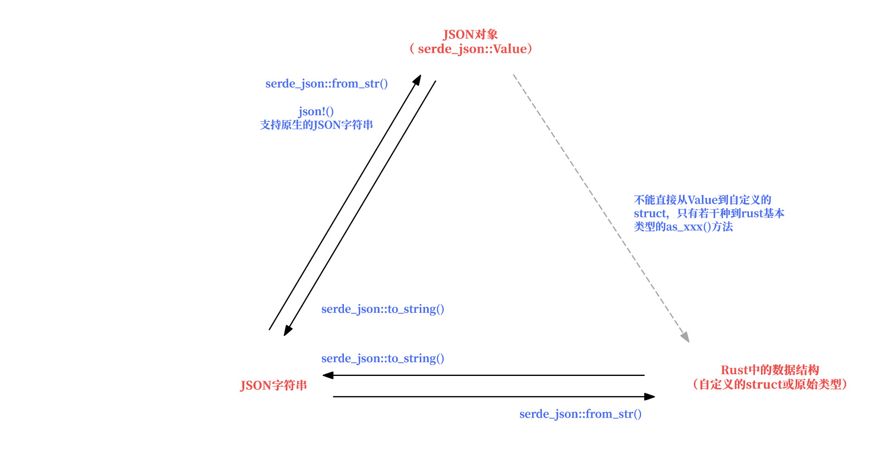

# serde_json

要解决的核心问题有：

* 了解以下3种对象之间如何转换：
  * serde_json中表示JSON的原生对象（即**`serde_json::Value`**），
  * JSON字符串
  * Rust中各种原始类型和自定义的数据结构（例如`struct`）

* `Value`中的属性如何访问，分为`Value`的结构已知和未知两种情况




## JSON字符串  **⇔**  `serde_json::Value` 

**JSON字符串到`Value` 的转换：**

```rust
use serde_json::{json, Value};
fn main() -> () {
    //方法1：rust原生字符串到Value
    let data = r#"
    {
        "name": "John Doe",
        "age": 43,
        "phones": ["+44 1234567", "+44 2345678"]
    }"#;
    let v: Value = serde_json::from_str(data).unwrap();
    println!("first phone number: {}, age is {}", v["phones"][0], v["age"]);

    //方法2：原生JSON写法到Value，姑且也算是字符串的一种方式
    let v: Value = json!({
        "name": "John Doe",
        "age": 43,
        "phones": ["+44 1234567", "+44 2345678"]
    });
    println!("first phone number: {}, age is {}", v["phones"][0], v["age"]);
}
```


 **`serde_json::Value`到JSON字符串的转换：**

```rust
fn main() -> () {
    let v: Value = json!({
        "name": "John Doe",
        "age": 43,
        "phones": ["+44 1234567", "+44 2345678"]
    });
    //方法1：
    println!("{}", v.to_string());

    //方法2：
    println!("{}", serde_json::to_string(&v).unwrap());
}
```


##  `serde_json::Value`  **⇔**  Rust中的各种数据结构

 **`Value`到Rust中各种自定义数据结构（例如`struct`） 的转换：**

没有直接支持的方式


 **`Value`到Rust中各种原始类型的转换：**

各种`Value`中的各种`to_xxx()`方法


**Rust中的各种数据结构到`Value` 的转换：**

没有直接支持的方式，需要先转为JSON字符串再转为`Value`


## JSON字符串  **⇔**  Rust中的各种数据结构

**JSON字符串到 `struct`**的转换

需要Rust中的数据结构实现了`Serialize`和 `Deserialize`

```rust
use serde::{Deserialize, Serialize};

#[derive(Serialize, Deserialize)]
struct Person {
    name: String,
    age: u8,
    phones: Vec<String>,
}
fn main() {
    let data = r#"
    {
        "name": "John Doe",
        "age": 43,
        "phones": [
            "+44 1234567",
            "+44 2345678"
        ]
    }"#;
    let p: Person = serde_json::from_str(data).unwrap();
    // Do things just like with any other Rust data structure.
    println!("Please call {} at the number {}", p.name, p.phones[0]);
}
```


**Rust中的各种数据结构到JSON字符的转换**

`serde_json::to_string()`
