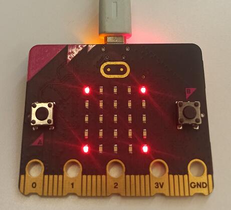
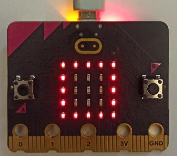
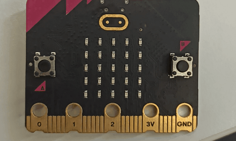
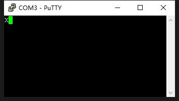

# 《Discovery》学习笔记

# 说明

本文是Win10下的[《Discovery》](https://docs.rust-embedded.org/discovery/microbit/index.html)学习笔记，按照自己的理解重写了全部代码（其实基本照抄，只修改了一些细节和增加注释），并做了以下调整：

  * Rust Edition：原书采用2018，本文采用2021
  * 只使用micro:bit v2进行实验，因此精简了部分源码，删除了micro:bit v1的相关内容
  * 所有命令都是在powershell下运行的

在阅读《Discovery》之前建议先阅读并理解[《The embedonomicon》](https://docs.rust-embedded.org/embedonomicon/preface.html)，我是先看了后者并完成[相关笔记](./embedonomicon.md)之后再回来学习《Discovery》，发现很多《Discovery》中未提及的细节的原理在《The embedonomicon》中都有详细的解释。我也会将这些细节列出来，通过关联二者我们能够更好理解相关内容。


全部代码请见[这里](https://github.com/youth7/rust-embed-discovery)


# 【0~4】前提准备

## 相关工具

**硬件：**

* [micro:bit v2](https://microbit.org/get-started/user-guide/overview/)
* USB数据线，用来连接micro:bit v2和PC

以上硬件各大电商平台都有售


**软件：**

下载并安装以下工具

| 名称              | 版本      | 地址/备注                                                    |
| ----------------- | --------- | ------------------------------------------------------------ |
| Rust              | 1.64.0    | 一定要升级到高版本，低版本的rust会导致安装`cargo embed`失败，见这个[issue](https://github.com/probe-rs/cargo-embed/issues/378)。安装完rust后还需要用命令`rustup target add thumbv7em-none-eabihf`来增加目标编译平台，因为我们需要再win上交叉编译到arm。 |
| cargo-binutils    | 0.3.6     | https://github.com/rust-embedded/cargo-binutils              |
| cargo- embed      | 0.13.0    | https://github.com/probe-rs/cargo-embed                      |
| putty             | 0.77      | https://the.earth.li/~sgtatham/putty/latest/w64/putty-64bit-0.77-installer.msi) |
| arm-none-eabi-gdb | 11.3.Rel1 | [https://armkeil.blob.core.windows.net/developer/Files/downloads/gnu/11.3.rel1/binrel/arm-gnu-toolchain-11.3.rel1-mingw-w64-i686-arm-none-eabi.exe](https://armkeil.blob.core.windows.net/developer/Files/downloads/gnu/11.3.rel1/binrel/arm-gnu-toolchain-11.3.rel1-mingw-w64-i686-arm-none-eabi.exe)。 |

安装完毕后使用以下命令`rustc -V;cargo size -V;cargo-embed -V`检验：

```powershell
rustc 1.64.0 (a55dd71d5 2022-09-19)
cargo-size 0.3.6
cargo-embed #这里缺失了版本号信息，这是因为bug(https://github.com/probe-rs/cargo-embed/issues/389)导致的，可以不用管
```

**文档：**

* [《Cortex -M4 Devices Generic User Guide》](https://developer.arm.com/documentation/dui0553/b/?lang=en)：microbit:v2使用了这个幸型号的CPU，虽然原文没有直接使用它，但本文解释代码的时候会用到。


## 术语理解

在嵌入式里面有不同的抽象层次，例如：

* PAC（Peripheral Access Crate）：对芯片上外设接口的直接抽象，这是相当低的一个抽象层，能够控制，只有当有高层抽象无法满足时候需求时候才会使用。使用PAC需要了解硬件的特性（如果不是专门做嵌入式的，看那一套API是根本不知道代表什么外设，因此PAC其实是不怎么易用）

* HAL（The Hardware Abstraction Layer）：因为PAC实在太底层了，直接用它并不方便，于是在其之上构建了HAL以便抽象芯片上的所有外设，通常会将芯片上的所有外设抽象为一个能收发数据的struct。
* BSP（The  Board Support Package）：对整块开发板（例如micro:bit v2）的抽象，构建于HAL之上。


如果依然不太明白上述概念，直接去看一下相关API就马上能感受到了，书中用到的相关库如下（仅针对micro:bit v2）：

| 抽象层         | 库                                                           |
| -------------- | ------------------------------------------------------------ |
| 第1层抽象：PAC | [https://docs.rs/nrf52833-pac/0.12.2/nrf52833_pac/](https://docs.rs/nrf52833-pac/0.12.2/nrf52833_pac/) |
| 第2层抽象：HAL | [https://docs.rs/nrf52833-hal/0.16.0/nrf52833_hal/](https://docs.rs/nrf52833-hal/0.16.0/nrf52833_hal/) |
| 第3层抽象：BSP | [https://docs.rs/microbit-v2/0.13.0/microbit/](https://docs.rs/microbit-v2/0.13.0/microbit/) |

每一款硬件都抽象一个HAL是可行的，但这样程序就很难移植，设计一个尽可能通用的HAL对绝大多数硬件进行抽象是有必要的。在rust嵌入式开发中，[`embedded-hal`](https://crates.io/crates/embedded-hal)就是对第2层的通用抽象。这就是文中说的统一图层（Unifying the layers），简单来说就是面向接口开发，使得代码可以移植和复用。


# 【5】LED轮盘

本章节主要是在micro:bit v2上实现一个类似LED跑马灯的效果，此过程涉及到构建、烧录、debug、迭代代码等步骤，非常直观地让读者感受到嵌入式开发的基本流程和要素。本章节全部代码见[这里](https://github.com/youth7/rust-embed-discovery/tree/main/05-led-roulette)

## 代码分析

>  本章节代码的所有细节在《The embedonomicon》中都仔细描述过，强烈建议先去看!

回忆《The embedonomicon》中用Rust对ARM进行裸机编程的过程，可以分为以下几步

1. 编写相关的功能代码，代码至少必须包含vector_table，其中vector_table中的前两项（`ISP`和`Reset`）
2. 通过链接脚本调整目标文件的内存布局，这步的目的是：
   1. 遵循硬件的内存规范
   2. 为用户程序运行中特定的需求做准备

2. 将启动函数加载（烧录）到硬件指定的内存位置
3. 启动硬件，硬件将运行vector_table中的`Reset`指向的函数

《Discovery》并不是从零开始进行嵌入式开发，它将步骤2中一系列繁琐的工作用库实现了，使得整个开发过程非常简洁，但是大量的细节被屏蔽了，下面我们来重复一下整个过程。


先用命令`cargo new --bin led-roulette`创建一个bin类型的package，然后修改`src/main.rs`：

```rust
#![deny(unsafe_code)]
#![no_main]
#![no_std]

use cortex_m_rt::entry;//这个和《The embedonomicon》中的entry宏原理是一样的，原理是库函数才是真正的入口，然后库函数再来加载用户函数
use panic_halt as _;
use microbit as _;

#[entry]
fn main() -> ! {//发散函数，《The embedonomicon》也说过
    let _y;
    let x = 42;
    _y = x;
    // infinite loop; just so we don't leave this stack frame
    loop {}
}
```

然后修改`.cargo/config.toml`

```toml
[target.'cfg(all(target_arch = "arm", target_os = "none"))']
rustflags = [
  "-C", "link-arg=-Tlink.x",
]
```

这里指定编译时使用库[cortex-m-rt](https://docs.rs/cortex-m-rt/latest/cortex_m_rt/)提供的链接脚本`link.x`，以及项目的编译的target等。（编译完成后你会发现工程目录`.\target\thumbv7em-none-eabihf\debug\build\cortex-m-rt-<xxxx>\out`下能找到`link.x`，这个链接脚本做的第一件事情就是引入下面提到的`memory.x`文件）

和《The embedonomicon》不一样的是，这里需要用`build.rs`将`memory.x`复制到一个构建脚本能够搜索得到的位置，这是库`cortex-m-rt`的要求，个人猜测这是为了通用性将可变的部分拆分出来由应用本身提供。

接着是修改`Cargo.toml`加入相关依赖

```toml
[package]
name = "led-roulette"
version = "0.1.0"
authors = ["Henrik Böving <hargonix@gmail.com>"]
edition = "2021"


[dependencies]
cortex-m = "0.7.6"
cortex-m-rt = "0.7.1"
panic-halt = "0.2.0"
microbit-v2 = "0.13.0"
```

最后是`Embed.toml`，它是`cargo embed`的配置文件，各项的意义参考[这里](https://github.com/probe-rs/cargo-embed/blob/master/src/config/default.toml)

```toml
[default.general]
chip = "nrf52833_xxAA" #芯片信息

[default.reset]
halt_afterwards = true #重置后挂起程序，这样就不会进入无线循环

#禁用rtt，如果希望使用rtt来打印数据则开启。有些实验必须开启rtt才能观察数据的传输，而有些则可以直接观察开发板的led灯或者putty的控制台输出
[default.rtt] 
enabled = false

[default.gdb] #开启gdb debug
enabled = true
```


## 构建

完成上述一系列准备后用下面的命令构建

```powershell
rustup target add thumbv7em-none-eabihf    #添加相关target
cargo build --target thumbv7em-none-eabihf #编译
```

编译通过后检查一下结果

```powershell
 rust-readobj .\target\thumbv7em-none-eabihf\debug\led-roulette --file-headers --elf-output-style=GNU
```

输出如下：

```powershell
ELF Header:
  Magic:   7f 45 4c 46 01 01 01 00 00 00 00 00 00 00 00 00        
  Class:                             ELF32
  Data:                              2's complement, little endian
  Version:                           1 (current)
  OS/ABI:                            UNIX - System V
  ABI Version:                       0
  Type:                              EXEC (Executable file)       
  Machine:                           ARM
  Version:                           0x1
  Entry point address:               0x401
  Start of program headers:          52 (bytes into file)
  Start of section headers:          880180 (bytes into file)
  Flags:                             0x5000400
  Size of this header:               52 (bytes)
  Size of program headers:           32 (bytes)
  Number of program headers:         4
  Size of section headers:           40 (bytes)
  Number of section headers:         24
  Section header string table index: 22
```

可见确实生成了ARM平台的可执行文件


## 烧录

刷之前先用USB数据线将micro:bit v2和PC连接，然后执行以下命令将上一步生成的ELF文件烧录到硬件

```powershell
cargo embed --target thumbv7em-none-eabihf # 每次更新代码后都需要用这个命令将程序烧录到开发板，下面简称为`cargo-embed`，不再每次重复
```

> `cargo embed`会将ELF文件按照硬件的规范刷到指定的位置，它支持 nRF5x、STM32 、 LPC800等芯片，在《The embedonomicon》中因为使用QEMU模拟器的原因，这一步通过命令行参数直接完成了。

顺利的话会有以下输出：

```powershell
    Finished dev [unoptimized + debuginfo] target(s) in 0.04s
      Config default
      ...
     Erasing sectors ✔ [00:00:00] [############################################################################################################]  4.00KiB/ 4.00KiB @ 25.10KiB/s (eta 0s )
 Programming pages   ✔ [00:00:00] [############################################################################################################]  4.00KiB/ 4.00KiB @ 12.83KiB/s (eta 0s )
    Finished flashing in 0.399s
    GDB stub listening at 127.0.0.1:1337
```

`cargo embed`完成了以下事情：

* 擦除开发板上的旧数据，写入新数据（我们的代码）
* 让开发板在reset之后挂起，不要立即执行`main`进入无限循环
* 在PC上开启一个GDB代理，为下一步的debug做准备

步骤2、3在`Embed.toml`上有所体现。  此时被烧录进去的ELF文件是硬件上唯一运行的程序，不依赖操作系统直接控制硬件。


## debug

在上一步的基础上，打开一个新窗口并执行命令：`arm-none-eabi-gdb.exe  target/thumbv7em-none-eabihf/debug/led-roulette`

```powershell
arm-none-eabi-gdb.exe  target/thumbv7em-none-eabihf/debug/led-roulette
GNU gdb (Arm GNU Toolchain 11.3.Rel1) 12.1.90.20220802-git
...
Reading symbols from target/thumbv7em-none-eabihf/debug/led-roulette...
(gdb) 
```

然后连上GDB代理

```powershell
(gdb) target remote :1337
Remote debugging using :1337	# 连上gdb代理
0x00000100 in nrf52833_pac::{impl#280}::fmt (self=0x1c3e9442, f=0x797af19f) at src/lib.rs:163
163     #[derive(Copy, Clone, Debug, PartialEq, Eq)]
(gdb)
```

设置断点并检查相关变量的值

```powershell
(gdb) break main	# 在main函数上打一个断点
Breakpoint 1 at 0x164: file src/main.rs, line 9.
Note: automatically using hardware breakpoints for read-only addresses.
(gdb) c				# 继续运行直到断点
Continuing.

Breakpoint 1, led_roulette::__cortex_m_rt_main_trampoline () at src/main.rs:9
9       #[entry]
(gdb) break 13		# 在main.rs的13行打一个断点
Breakpoint 2 at 0x170: file src/main.rs, line 13.
(gdb) c				# 继续运行直到断点
Continuing.

Program received signal SIGINT, Interrupt.
led_roulette::__cortex_m_rt_main () at src/main.rs:10
10      fn main() -> ! {//€The embedonomicon€
(gdb) c				# 继续运行直到断点，不知道为何出了中断后c命令没有直接运行到断点处
Continuing.

Breakpoint 2, led_roulette::__cortex_m_rt_main () at src/main.rs:13
13          _y = x;
(gdb) print x		# 打印main函数中_y变量的值
$2 = 42
(gdb)
```


## 用代码点亮led

完成上述步骤后表明前期一切准备已经就绪，可以开始编写特定的功能代码了，先来实现一个简单的任务：点亮开发板上的小灯。为了让代码简洁作者用了[microbit的bsp](https://docs.rs/microbit-v2/0.13.0/microbit/)。修改`src/main.js`如下：

```rust
#![deny(unsafe_code)]
#![no_main]
#![no_std]

use cortex_m_rt::entry;//这个和《The embedonomicon》中的entry宏原理是一样的，原理是库函数才是真正的入口，然后库函数再来加载用户函数
use panic_halt as _;
use microbit::board::Board;
use microbit::hal::prelude::*;

#[entry]
fn main() -> ! {//发散函数，《The embedonomicon》也说过
    let mut board = Board::take().unwrap();
    // 这个api控制的是整行/列的pin的状态，而一个灯点亮的条件是对应的pin上同时有高低两种状态
    // 例如以下代码会点亮四个角的led
    board.display_pins.col1.set_low().unwrap();
    board.display_pins.row1.set_high().unwrap();

    board.display_pins.col5.set_low().unwrap();
    board.display_pins.row5.set_high().unwrap();
    // infinite loop; just so we don't leave this stack frame
    loop {}
}
```

此时不需要调试和开机挂起，所以修改`Emged.toml`为：

```toml
[default.general]
chip = "nrf52833_xxAA" #芯片信息

[default.reset]
halt_afterwards = false #禁用重置后挂起程序

[default.rtt] #禁用rtt
enabled = false

[default.gdb] #关闭gdb debug
enabled = false
```

然后像上面那样使用`cargo-embed`将程序烧录到开发板，此时你会发现四个顶点的灯被点亮了（因为稍微修改了一下程序），效果如下：




## 用代码控制led闪烁

闪烁的原理是使用bsp提供的相关API，通过这些API可以控制开发板上的定时器，从而让程序停止运行一小段时间。我们先实现一个简单的例子：让程序每隔一秒往控制台打印一些内容。

先修改`src/main.js`：

```rust
#![deny(unsafe_code)]
#![no_main]
#![no_std]

use cortex_m_rt::entry;//这个和《The embedonomicon》中的entry宏原理是一样的，原理是库函数才是真正的入口，然后库函数再来加载用户函数
use rtt_target::{rtt_init_print, rprintln};
use panic_rtt_target as _;
use microbit::board::Board;
use microbit::hal::timer::Timer;
use microbit::hal::prelude::*;

#[entry]
fn main() -> ! {//发散函数，《The embedonomicon》也说过
    rtt_init_print!();
    let mut board = Board::take().unwrap();
    let mut timer = Timer::new(board.TIMER0);
    loop {
        timer.delay_ms(1000u16);// 让程序暂停一小段时间
        rprintln!("1000 ms passed");
    }
}
```

同时修改`Embed.toml`开启[rtt (Real Time Transfer)](https://www.segger.com/products/debug-probes/j-link/technology/about-real-time-transfer/#what-is-rtt)

>  关于嵌入式集中输出技术可以看看这篇文章[《嵌入式 printf的几种办法 (ITM、SWO、semihosting、Keil Debug Viewer、RTT、串口重定向printf)》](https://blog.csdn.net/u014285530/article/details/118554828)，个人觉得不必纠结所有细节，知道都属于输出技术即可

```toml
[default.general]
chip = "nrf52833_xxAA" #芯片信息

[default.reset]
halt_afterwards = false #禁用重置后挂起程序，这样开发板重置后就立马运行程序不会像之前那样停下来

[default.rtt] #开启rtt
enabled = true

[default.gdb] #关闭gdb debug
enabled = false
```

执行cargo-embed后控制台输出如下：

```powershell
 Terminal
11:58:11.734 1000 ms passed
11:58:12.761 1000 ms passed
11:58:13.760 1000 ms passed
11:58:14.752 1000 ms passed
11:58:15.751 1000 ms passed
11:58:16.753 1000 ms passed
...
```

此时已经实现了间隔输出，有了这个基础实现闪烁就非常容易了，修改`main.rs`如下：

```rust
#![deny(unsafe_code)]
#![no_main]
#![no_std]

use cortex_m_rt::entry;//这个和《The embedonomicon》中的entry宏原理是一样的，原理是库函数才是真正的入口，然后库函数再来加载用户函数
use rtt_target::{rtt_init_print, rprintln};
use panic_rtt_target as _;
use microbit::board::Board;
use microbit::hal::timer::Timer;
use microbit::hal::prelude::*;

#[entry]
fn main() -> ! {//发散函数，《The embedonomicon》也说过
    rtt_init_print!();
    let mut board = Board::take().unwrap();
    let mut timer = Timer::new(board.TIMER0);
    board.display_pins.col1.set_low().unwrap();
    loop {
        board.display_pins.row1.set_high().unwrap();//点亮
        timer.delay_ms(1000u16);//让程序停止执行一小段时间
        rprintln!("点亮");
        board.display_pins.row1.set_low().unwrap();//熄灭
        timer.delay_ms(1000u16);//让程序停止执行一小段时间
        rprintln!("熄灭");
    }
}
```

## 用led实现扩散波纹效果

像上面那样对单个led进行点亮是非常繁琐的事情，特别是一次性控制多个led的时候，因此bsp上面提供了[一些API](https://docs.rs/microbit-v2/0.13.0/microbit/display/blocking/struct.Display.html#method.show)以简化这个过程。这些API通过一个5x5的矩阵来控制led，大幅精简了代码。例如点亮最外一圈的led灯可以这样做：

```rust
#![deny(unsafe_code)]
#![no_main]
#![no_std]

use cortex_m_rt::entry;//这个和《The embedonomicon》中的entry宏原理是一样的，原理是库函数才是真正的入口，然后库函数再来加载用户函数
use rtt_target::rtt_init_print;
use panic_halt as _;
use microbit::{
    board::Board,
    display::blocking::Display,
    hal::{prelude::*, Timer},
};

#[entry]
fn main() -> ! {//发散函数，《The embedonomicon》也说过
    rtt_init_print!();//初始化rtt，不调用会报错
    let board = Board::take().unwrap();
    let mut timer = Timer::new(board.TIMER0);//初始化一个定时器
    let mut display = Display::new(board.display_pins);//初始化一个用于显示的对象
    let light_it_all = [//用5x5的矩阵来控制led亮灭
        [1, 1, 1, 1, 1],
        [1, 0, 0, 0, 1],
        [1, 0, 0, 0, 1],
        [1, 0, 0, 0, 1],
        [1, 1, 1, 1, 1],
    ];
    loop {
        display.show(&mut timer, light_it_all, 5000);
    }
}
```

执行`cargo-embed`命令后效果如下： 




有了上面的基础我们就能够实现复杂的效果，这里我将原文的转盘效果改成了波纹

```rust
#![deny(unsafe_code)]
#![no_main]
#![no_std]

use cortex_m_rt::entry; //这个和《The embedonomicon》中的entry宏原理是一样的，原理是库函数才是真正的入口，然后库函数再来加载用户函数
use microbit::{
    board::Board,
    display::blocking::Display,
    hal::{prelude::*, Timer},
};
use panic_halt as _;

#[entry]
fn main() -> ! {
    //发散函数，《The embedonomicon》也说过

    let board = Board::take().unwrap();
    let mut timer = Timer::new(board.TIMER0);
    let mut display = Display::new(board.display_pins);
    let circle2 = [
        // 外圈全亮
        [1, 1, 1, 1, 1],
        [1, 0, 0, 0, 1],
        [1, 0, 0, 0, 1],
        [1, 0, 0, 0, 1],
        [1, 1, 1, 1, 1],
    ];
    let circle1 = [
        // 中间圈全亮
        [0, 0, 0, 0, 0],
        [0, 1, 1, 1, 0],
        [0, 1, 0, 1, 0],
        [0, 1, 1, 1, 0],
        [0, 0, 0, 0, 0],
    ];
    let circle0 = [
        // 里圈全亮
        [0, 0, 0, 0, 0],
        [0, 0, 0, 0, 0],
        [0, 0, 1, 0, 0],
        [0, 0, 0, 0, 0],
        [0, 0, 0, 0, 0],
    ];

    let light_up_duration = 100;

    loop {
        display.show(&mut timer, circle0, light_up_duration);
        display.clear();
        display.show(&mut timer, circle1, light_up_duration);
        display.clear();
        display.show(&mut timer, circle2, light_up_duration);
        display.clear();
        timer.delay_ms(500u16);

    }
}
```

没有这里不再需要使用rtt来debug，因此需要将`Embed.toml`中的rtt选项禁用

```toml
[default.general]
chip = "nrf52833_xxAA" #芯片信息

[default.reset]
halt_afterwards = false #禁用重置后挂起程序

[default.rtt] #关闭rtt
enabled = false

[default.gdb] #关闭gdb debug
enabled = false
```

执行`cargo-embed`后最终效果如下： 



至此我们终于用Rust完成第一个嵌入式程序的开发了。


# 【6】串口通讯准备

## 基本概念

对串口通讯不熟悉的话先了解一下基本概念：

* [看完这篇，不要说不懂串口通信！](https://www.eet-china.com/mp/a69082.html)
* [Serial communication](https://en.wikipedia.org/wiki/Serial_communication)
* [[串口通信与编程01：串口基础知识]](https://www.cnblogs.com/menlsh/archive/2013/01/28/2880580.html)

接下来会分别介绍异步串口通讯（UART）和同步串口通讯（I2C）

## 环境准备    

按照以下步骤测试开发板上的串口是否与PC上串口成功连接

* 用USB数据线将开发板与PC连接
* 按照[这里的介绍](https://blog.csdn.net/wwws1994/article/details/104482499)设置putty（一定要先勾选了`Seesion/Serial`后再去设置`Connection/Serial`），注意输入正确的端口和相关参数。
* 一切成功的话会弹出一个控制台，往控制台输入内容你会发现板子上的USB连接端口的黄灯会不断闪烁，效果如下：    


此时开发板已经通过跟PC上的串口相连，下一章我们将控制开发板往串口发送数据


# 【7 UART】

本章节主要介绍如何使用UART协议进行串口通讯，因此运行程序的时候记得按照上述设置putty连上PC上的串口，完整代码见[这里](https://github.com/youth7/rust-embed-discovery/tree/main/07-urat)。

先用`cargo new uart --bin`创建一个新项目，然后将上一个项目的`.cargo/config.toml`、`build.rs`、`memory.x`、`Embed.toml`全部拷贝过来。因为使用了新的依赖，需要修改`cargo.toml`：

```rust
[package]
name = "urat"
version = "0.1.0"
edition = "2021"

[dependencies]
cortex-m = "0.7.6"
cortex-m-rt = "0.7.1"
rtt-target = { version = "0.3.1", features = ["cortex-m"] }
panic-rtt-target = { version = "0.1.2", features = ["cortex-m"] }
nb = "1.0.0"
heapless = "0.7.16"
embedded-hal = "0.2.7"
microbit-v2 = { version = "0.13.0" }
```

关于uart的基础可以看：

* [UART串口协议详解](https://zhuanlan.zhihu.com/p/150504364)


## 发送一个字节

先完成最简单的功能：控制开发板往串口发送一个字节，`main.rs`代码如下：

```rust
#![no_main]
#![no_std]

use cortex_m_rt::entry; // cortex-m的运行时
use panic_rtt_target as _;
use rtt_target::rtt_init_print;

use microbit::{
    hal::prelude::*,
    hal::uarte::{Baudrate, Parity, Uarte},
};

static mut TX_BUF: [u8; 1] = [0; 1];
static mut RX_BUF: [u8; 1] = [0; 1];

#[entry]
fn main() -> ! {
    rtt_init_print!(); //初始化rtt
    let board = microbit::Board::take().unwrap();
    let uarte_instance = Uarte::new(//构造一个uarte实例
        board.UARTE0,
        board.uart.into(),
        Parity::EXCLUDED,
        Baudrate::BAUD115200,
    );
    //将uarte实例上的tx和rx提取出来单独使用
    let (mut tx, _rx) = uarte_instance
        .split(unsafe { &mut TX_BUF }, unsafe { &mut RX_BUF })
        .unwrap();
    nb::block!(tx.write(b'X')).unwrap(); //往串口上写入字符X
    nb::block!(tx.flush()).unwrap(); //强制清空缓冲区，立即写入

    loop {}
}
```

使用`cargo-embed`烧录后putty的控制台会出现字母X，表示写入成功  


   


> 关于UART和UARTE的区别可以看[这里](https://devzone.nordicsemi.com/f/nordic-q-a/62055/uart-and-uarte-difference)


## 发送一个字符串

发送一个字符串有两种方式：

1. 重复调用`tx`上的`write()`方法
2. 调用`tx`上的`write_str()`方法

```rust
#![no_main]
#![no_std]

use core::fmt::Write;

use cortex_m_rt::entry; // cortex-m的运行时
use panic_rtt_target as _;
use rtt_target::rtt_init_print;

use microbit::{
    hal::prelude::*,
    hal::uarte::{Baudrate, Parity, Uarte},
};

static mut TX_BUF: [u8; 1] = [0; 1];
static mut RX_BUF: [u8; 1] = [0; 1];

#[entry]
fn main() -> ! {
    rtt_init_print!(); //初始化rtt
    let board = microbit::Board::take().unwrap();
    let uarte_instance = Uarte::new(
        //构造一个uarte实例
        board.UARTE0,
        board.uart.into(),
        Parity::EXCLUDED,
        Baudrate::BAUD115200,
    );
    //将uarte实例上的tx和rx提取出来单独使用
    let (mut tx, _rx) = uarte_instance
        .split(unsafe { &mut TX_BUF }, unsafe { &mut RX_BUF })
        .unwrap();

    for byte in b"\xE9\x9B\xB7\xE7\x8C\xB4\r\n".iter() {
        nb::block!(tx.write(*byte)).unwrap(); //往串口上写入字符X
    }
    
    tx.write_str("The quick brown fox jumps over the lazy dog.\r\n\n").unwrap();
    loop {}
}
```


## 接收一个字节

接收字节也是非常简单，只需要调用`rx`上的`read()`即可

```rust
#![no_main]
#![no_std]


use cortex_m_rt::entry; // cortex-m的运行时
use panic_rtt_target as _;
use rtt_target::{rtt_init_print, rprint};

use microbit::{
    hal::prelude::*,
    hal::uarte::{Baudrate, Parity, Uarte},
};

static mut TX_BUF: [u8; 1] = [0; 1];
static mut RX_BUF: [u8; 1] = [0; 1];

#[entry]
fn main() -> ! {
    rtt_init_print!(); //初始化rtt
    let board = microbit::Board::take().unwrap();
    let uarte_instance = Uarte::new(
        //构造一个uarte实例
        board.UARTE0,
        board.uart.into(),
        Parity::EXCLUDED,
        Baudrate::BAUD115200,
    );
    //将uarte实例上的tx和rx提取出来单独使用
    let (mut _tx, mut rx) = uarte_instance
        .split(unsafe { &mut TX_BUF }, unsafe { &mut RX_BUF })
        .unwrap();
    loop {
        //read是非阻塞的，如果没有字符可读的时候会抛出一个异常，
        //为了能够读取到数据需要持续地调用read直到不抛异常为止，而nb::block其实就是做了这个事情
        let byte = nb::block!(rx.read()).unwrap();
        rprint!("{}", byte as char);// 将接收到的字符通过rtt回显
    }
}
```

此时在putty窗口中不断输入ascii字符，则rtt控制台会输出对应的字符


## 实现Echo服务器

实现这个要做到以下2点：

1. 缓存putty的输入，在一般情况下需要堆这样的内存空间，但我们是裸机编程，因此不会有OS给我们提供API来创建堆。
2. 监听输入的每个字符，碰到回车字符的时候将缓存中的内容通过串口发送出去。

第1点我们可以通过第三方库[`heapless::Vec`](https://docs.rs/heapless/latest/heapless/struct.Vec.html)来解决，这个库提供一些**定长**的常用数据结构，这意味着无法自动增长，当填入的数据超出限定时相关方法会报错。 

第2点很简单，判断输入的值即可。

结合上述两点，实现的代码如下：

```rust
#![no_main]
#![no_std]

use core::fmt::Write;
use core::str;
use cortex_m_rt::entry; // cortex-m的运行时
use panic_rtt_target as _;
use rtt_target::{rtt_init_print, rprintln};
use heapless::Vec;

use microbit::{
    hal::prelude::*,
    hal::uarte::{Baudrate, Parity, Uarte, UarteTx}, pac::{UARTE0},
};

static mut TX_BUF: [u8; 1] = [0; 1];
static mut RX_BUF: [u8; 1] = [0; 1];

#[entry]
fn main() -> ! {
    rtt_init_print!(); //初始化rtt
    let board = microbit::Board::take().unwrap();
    let uarte_instance = Uarte::new(
        //构造一个uarte实例
        board.UARTE0,
        board.uart.into(),
        Parity::EXCLUDED,
        Baudrate::BAUD115200,
    );
    //将uarte实例上的tx和rx提取出来单独使用
    let (mut tx, mut rx) = uarte_instance
        .split(unsafe { &mut TX_BUF }, unsafe { &mut RX_BUF })
        .unwrap();
    let mut buffer:Vec<u8, 32> = Vec::new();    
    loop {
        //read是非阻塞的，如果没有字符可读的时候会抛出一个异常，
        //为了能够读取到数据需要持续地调用read直到不抛异常为止，而nb::block其实就是做了这个事情
        let byte = nb::block!(rx.read()).unwrap();
        if byte == 0x0D {
            send_str(&mut tx, &mut buffer);
        }else{
            if buffer.push(byte).is_err() {
                send_str(&mut tx, &mut buffer);//如果超出长度就立即发送出去
                continue;
            }
        }
    }
}

fn send_str(tx: &mut UarteTx<UARTE0>, buffer: &mut Vec<u8, 32>){//发送字符串
    let content = str::from_utf8(&buffer).unwrap();
    rprintln!("{}", content);//在rtt控制台上检查接收的内容
    tx.write_str(content).unwrap();//原封不动回写全部内容
    tx.write_str("\r\n").unwrap();//加上回车换行以便显示
    nb::block!(tx.flush()).unwrap();//刷新缓冲区以免内容残留
    buffer.clear();//清空buffer以接收下一次内容
}
```


# 【8 I2C】

本章节主要介绍如何使用I2C协议进行串口通讯，与UART的区别是I2C是一个同步协议，并且使用半双工通讯（这一点很关键，会在编程模型中有所体现）。原文用了很长的篇幅介绍I2C的基本原理，其中有一些需要微电子相关知识才能完全理解，但这不重要，我们只需要关注库提供的编程接口即可，完整代码见[这里]()。


## 读取单个寄存器的值

开发板上的两个传感器（磁力计+加速度计）被封装在一个小组件（LSM303AGR 集成电路）中，可以通过I2C总线来访问。对外看来它俩像是具备不同地址的从机。每个设备都有自己的内存（貌似就是一大堆的寄存器）用来存储它们的感知结果，我们主要通过读写这些内存与设备交互。具体的通讯细节原文有详细介绍这里不再重复，关键之处是通过总线进行半双工的通讯。

从某种意义上说，这两个设备和开发板上的**内部外设**是非常相似的，**唯一的区别是它们的寄存器没有映射到开发板的内存空间中（因此不能通过读写开发板的内存空间来访问它们），所以访问它们需要通过i2c总线**。

像上一章那样，先用`cargo new i2c --bin`创建一个新项目，然后将然后将相关文件（`.cargo/config.toml`、`build.rs`、`memory.x`、`Embed.toml`）复制过来，然后修改`main.rs`：

```rust
#![no_main]
#![no_std]

use cortex_m_rt::entry;
use rtt_target::{rtt_init_print, rprintln};
use panic_rtt_target as _;

use microbit::hal::prelude::*;

use microbit::{
    hal::twim::Twim,
    pac::twim0::frequency::FREQUENCY_A,
};

const ACCELEROMETER_ADDR: u8 = 0b0011001;//加速计地址
const MAGNETOMETER_ADDR: u8 = 0b0011110;//磁力计地址

const ACCELEROMETER_ID_REG: u8 = 0x0f;//加速计的寄存器地址
const MAGNETOMETER_ID_REG: u8 = 0x4f;//磁力计的寄存器地址

#[entry]
fn main() -> ! {
    rtt_init_print!();
    let board = microbit::Board::take().unwrap();

    let mut i2c =  Twim::new(board.TWIM0, board.i2c_internal.into(), FREQUENCY_A::K100) ;//构造一个twim对象，它兼容i2c

    let mut acc = [0];//缓存，用来存放i2c设备的响应信息，这种通风格式和上一章uart不同，是因为i2c的半双工通讯
    let mut mag = [0];

    // 向设备的寄存器写入信息，然后读取设备的响应并写入到缓存中，
    i2c.write_read(ACCELEROMETER_ADDR, &[ACCELEROMETER_ID_REG], &mut acc).unwrap();
    i2c.write_read(MAGNETOMETER_ADDR, &[MAGNETOMETER_ID_REG], &mut mag).unwrap();

    rprintln!("The accelerometer chip's id is: {:#b}", acc[0]);
    rprintln!("The magnetometer  chip's id is: {:#b}", mag[0]);

    loop {}
}
```

要理解32、33这两行的代码必须仔细阅读[LSM303AGR的文档](https://www.st.com/resource/en/datasheet/lsm303agr.pdf)6.1.1节以及table20~23：

> After the start condition (ST) a slave address is sent, once a  slave acknowledge (SAK) has been returned, an 8-bit subaddress (SUB) is transmitted: **the  7 LSb represent the actual register address** while the MSB enables address auto increment. 

文档中规定从机回复SAK后，发送方必须发送一个用以表明寄存器地址的subaddress (SUB)，这意味着代码中传入寄存器的地址是有原因的。


## 使用驱动访问设备

通过上面的例子可知访问i2c设备是多么繁琐，为了简化这个过程我们可以使用驱动，它封装了全部细节并向用户提供了简洁的接口，

```rust
#![no_main]
#![no_std]

use cortex_m_rt::entry;
use rtt_target::{rtt_init_print, rprintln};
use panic_rtt_target as _;

use microbit::{
    hal::twim::Twim,
    pac::twim0::frequency::FREQUENCY_A,
};

use lsm303agr::{
    AccelOutputDataRate, Lsm303agr,
};


#[entry]
fn main() -> ! {
    rtt_init_print!();
    let board = microbit::Board::take().unwrap();

    let i2c =  Twim::new(board.TWIM0, board.i2c_internal.into(), FREQUENCY_A::K100) ;//构造一个twim对象，它兼容i2c

    // 使用Lsm303agr驱动来访问i2c设备
    let mut sensor = Lsm303agr::new_with_i2c(i2c);
    sensor.init().unwrap();
    sensor.set_accel_odr(AccelOutputDataRate::Hz50).unwrap();
    loop {
        if sensor.accel_status().unwrap().xyz_new_data {
            let data = sensor.accel_data().unwrap();
            // 将获取到的数据通过rtt输出到控制台
            rprintln!("Acceleration: x {} y {} z {}", data.x, data.y, data.z);
        }
    }
}
```

将程序烧录到开发板后会不断输出当前加速度的值，此时你不断摇晃开发板会发现输出的数值出现明显波动。


## 一个综合的应用

本章将会实现一个微型的应用，通过命令行参数控制开发板显示磁力计或加速计的内容，它的原理如下：

* 通过putty使用uart协议向开发板发送命令
* 根据用户发送的内容，通过i2c协议读取磁力计/加速计的内容
* 通过uart协议将读取到的数据返回给putty显示

具体代码如下：

```rust
#![no_main]
#![no_std]
use core::fmt::Write;
use heapless::Vec;

use cortex_m_rt::entry;
use panic_rtt_target as _;
use rtt_target::{rprintln, rtt_init_print};

use microbit::{
    hal::prelude::*,
    hal::uarte::{Baudrate, Parity, Pins, Uarte, UarteTx},
    hal::{twim::Twim, uarte::UarteRx},
    pac::twim0::frequency::FREQUENCY_A,
    pac::{TWIM0, UARTE0},
};

use lsm303agr::{
    interface::I2cInterface, mode::MagOneShot, AccelOutputDataRate, Lsm303agr, MagOutputDataRate,
};

static mut TX_BUF: [u8; 1] = [0; 1];
static mut RX_BUF: [u8; 1] = [0; 1];

#[entry]
fn main() -> ! {
    rtt_init_print!();
    let board = microbit::Board::take().unwrap();
    //初始化uart设备
    let (mut tx, mut rx) = get_tx_and_rx(
        board.UARTE0,
        board.uart.into(),
        Parity::EXCLUDED,
        Baudrate::BAUD115200,
    );
    //初始化i2c设备
    let i2c = Twim::new(board.TWIM0, board.i2c_internal.into(), FREQUENCY_A::K100);
    let sensor = init_sensor(i2c);
    let mut sensor = sensor.into_mag_continuous().ok().unwrap();
    let mut buffer: Vec<u8, 32> = Vec::new();
    loop {
        //阻塞读取uart设备
        let byte = nb::block!(rx.read()).unwrap();
        if byte == 0x0D {
            //判断读取到的内容
            let input = core::str::from_utf8(&buffer).unwrap();
            rprintln!("输入内容:{}", input);
            match input {//跟i2c通讯
                "a" => {
                    while !sensor.accel_status().unwrap().xyz_new_data {} // 等待直到数据就绪
                    let data = sensor.accel_data().unwrap();
                    writeln!(//回显读取到的内容
                        &mut tx,
                        "Acceleration: x {} y {} z {}\r",
                        data.x, data.y, data.z
                    ).unwrap();
                }
                "m" => {
                    while !sensor.mag_status().unwrap().x_new_data {} // 等待直到数据就绪
                    let data = sensor.mag_data().unwrap();
                    writeln!(
                        &mut tx,
                        "Magnetometer: x {} y {} z {}\r",
                        data.x, data.y, data.z
                    ).unwrap();
                }
                _ => writeln!(&mut tx, "命令无法识别:{}\r", input).unwrap(),
            };

            buffer.clear();
            continue;
        }
        if buffer.push(byte).is_err() {
            writeln!(&mut tx, "输入过长\r").unwrap();
            buffer.clear();
        }
    }
}

fn get_tx_and_rx(
    uarte: UARTE0,
    pins: Pins,
    parity: Parity,
    baudrate: Baudrate,
) -> (UarteTx<UARTE0>, UarteRx<UARTE0>) {
    let uarte_instance = Uarte::new(uarte, pins, parity, baudrate);
    uarte_instance
        .split(unsafe { &mut TX_BUF }, unsafe { &mut RX_BUF })
        .unwrap()
}

fn init_sensor(i2c: Twim<TWIM0>) -> Lsm303agr<I2cInterface<Twim<TWIM0>>, MagOneShot> {
    let mut sensor = Lsm303agr::new_with_i2c(i2c);
    sensor.init().unwrap();
    sensor.set_accel_odr(AccelOutputDataRate::Hz50).unwrap();
    sensor.set_mag_odr(MagOutputDataRate::Hz50).unwrap();
    sensor
}
```

