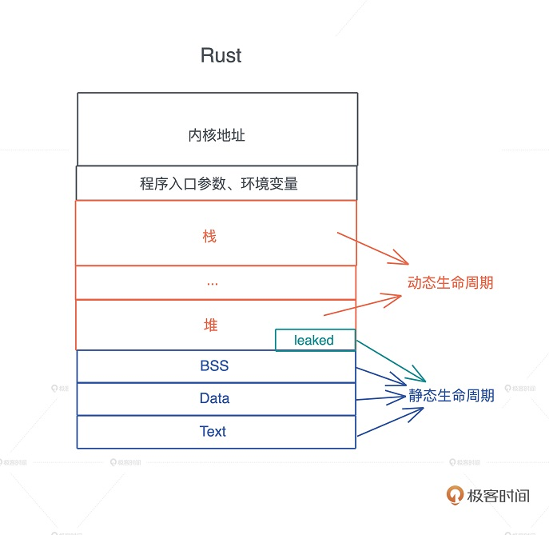

# 00 开篇词

## 值放堆上还是栈上

* **学习难点**：类型系统、泛型、并发安全

* **学习核心**：软件开发的核心概念（包括：堆、栈、函数、闭包、虚表、泛型、同步和异步等 ） ，**编程语言不过是软件开发核心概念的具体表述和载体**


## 基本概念

**数据：**

原生类型（primitive type）：所有原生类型见[这里](https://doc.rust-lang.org/stable/std/index.html#primitives)，Rust的原生类型比C语言丰富太多，例如以下几种类型居然也是原生的：

- [array](https://doc.rust-lang.org/stable/std/primitive.array.html)
- [fn](https://doc.rust-lang.org/stable/std/primitive.fn.html)
- [pointer](https://doc.rust-lang.org/stable/std/primitive.pointer.html)
- [reference](https://doc.rust-lang.org/stable/std/primitive.reference.html)
- [str](https://doc.rust-lang.org/stable/std/primitive.str.html)
- [tuple](https://doc.rust-lang.org/stable/std/primitive.tuple.html)

需要注意`reference`和`pointer`的区别，`reference`比`pointer`携带了更加多的信息（例如胖指针），更加安全（不能指向null），但也受到一些限制（只能解引用为原来的数据类型）。


# 01 前置篇

* stack上的数据：是静态的，指**静态大小**（编译器就能确定数据的大小），**静态生命周期**（与栈的生命周期一致）。其实这也不是绝对的，**例如`alloca()`就可以动态地在栈上分配内存**，C语言中的可变参也是分配在栈上的。但因为stack是较小且有限的，在上面动态分配空间容易导致溢出类问题。
* heap上的数据：是动态的，指动态大小（运行期间大小可能会改变），动态生命周期（可能会被多个栈引用）

# 02 基础篇

## 所有权

1. 关于所有权的一些要点：

   * **分清楚owner/value/reference/borrow，见下面*值的创建*相关讨论，这是重中之重**

   * 要注意区分引用和借用的关系，官方文档中有：

     > We call the action of creating a reference *borrowing*

   * Rust函数调用的时候**所有权会转移，例如`func(var)`并不会自动自动转为`func(&var)`并造成所有权转移**。


2. 通过所有所有权机制进行内存管理，解决了以下问题：

   * 资源自动释放，**它使得在一般情况下，堆上和栈上数据的生命周期一致了**

   * 防止数据被意外修改，同一时刻，一个值只有1个可变引用或者多个不可变引用

    > 所有权规则（编译时检查）：
    >
    > - Each value in Rust has an *owner*.
    > - There can only be one owner at a time.
    > - When the owner goes out of scope, the value will be dropped.


3. `Rc/Arc`提供了**共享所有权**（所有权规则的一个例外？），`Cell/RefCell`提供了**内部可变性**。这意味着除了`Rc/Arc`，其它标准库的数据对象都满足所有权规则。

   |            | 语法                | 所有权检查（3条规则）  |
   | ---------- | ------------------- | ---------------------- |
   | 外部可变性 | `let mut`或者`&mut` | 编译时检查（静态检查） |
   | 内部可变性 | 使用`Cell/RefCell`  | 运行时检查（动态检查） |

   


## 生命周期

* 重要的只有一句话：**生命周期的标记只是函数签名的一部分，它描述了入参和返回值的关系，不改变系统中任何对象的生命周期**。

* 生命周期的作用：防止读取到内存中的无效单元

* 生命周期中最难以理解的一些误解
  * `T: 'static` vs `&'static T`，关于它的解释见参考资料。简单来说，前者的`T`**包括了后者（即`&'static T`）和所有权类型**，反正**禁止涉及非`'static`生命周期的引用**，因为当`T`为非`'static`引用的时候可能不能满足一些使用场景（例如跨线程），见参考4。





参考：

* [Why does the compiler tell me to consider using a `let` binding" when I already am?](https://stackoverflow.com/questions/28893183/why-does-the-compiler-tell-me-to-consider-using-a-let-binding-when-i-already)
* [Rust 中常见的有关生命周期的误解](https://github.com/pretzelhammer/rust-blog/blob/master/posts/translations/zh-hans/common-rust-lifetime-misconceptions.md)
* https://practice.rs/lifetime/static.html
* [Learning Rust: static trait bounds](https://codeandbitters.com/static-trait-bound/)

## 内存管理

**值的创建**

* 栈上放胖指针，堆上放数据，绝大部分的Rust对象都是这种关系的。胖指针就是各种原生或者自定义的类型，例如以下代码：

  ```rust
  let s = String::from("hi");//s的类型String，是一个胖指针，在语义上来讲是owner
  let rs = &s;// rs的类型&String，它是一个引用，在语义上来讲是borrow
  ```

  | 对象                 | 语义              | 类型/分配                                         |
  | -------------------- | ----------------- | ------------------------------------------------- |
  | `s`                  | owner，所有权类型 | `String`这个结构体（智能指针），分配在栈上        |
  | `&s`                 | borrow，引用类型  | 是一个`&String`（普通引用，非胖指针），分配在栈上 |
  | `String::from("hi")` | value             | 分配在堆上的二进制数据                            |

  关于胖指针可以参考[Exploring Rust fat pointers](https://iandouglasscott.com/2018/05/28/exploring-rust-fat-pointers/)和https://doc.rust-lang.org/book/ch15-00-smart-pointers.html，其中官方文档中有一句：*in many cases, smart pointers own the data they point to.*

* `Option`、`Result`对引用类数据的优化

**值的销毁**

* `Drop` trait

* `RAII`

| 检查时机 | 编译时         | 运行时             |
| -------- | -------------- | ------------------ |
| 检查效果 | 高效、但不灵活 | 灵活、但有额外负担 |
| 检查位置 | 栈             | 堆                 |
| 检查机制 | borrow checker | 引用计数           |


## 类型系统

### trait的概括

trait的作用：

* 行为抽象：
* 泛型约束：trait bound
* 抽象类型：trait object
* 标签trait：

多态：在使用相同的接口时，不同类型的对象，会采用不同的实现  

| 多态类型              | 实现技术     | 备注                                            |
| --------------------- | ------------ | ----------------------------------------------- |
| 参数多态              | 泛型         | 包含泛型数据结构和泛型函数                      |
| adhoc多态（特设多态） | trait        | 指同一种行为有很多不同的实现（正是trait的用途） |
| 子类型多态            | trait object |                                                 |


### 普通泛型、`impl Trait` 和`dyn Trait`

* trait不是类型，类型是值的集合，而trait只能用来限制类型。例如我们不能写`x: Trait`而只能`<X: Trait>`，在后者中`Trait`对类型`X`做了一些限定，但**`Trait`并不是类型**。这种方式和`impl Trait`容易令人产生trait是类型的错觉。
* `impl Trait`和普通泛型`<X: Trait>`基本一样，都可用于函数的参数/返回值。但用于返回值时有细微区别：
  * `<X: Trait>`的**返回值是泛型**。caller在调用的时候确定返回值的具体类型（这也符号泛型的使用场景，开发者定义泛型，调用者确定泛型）
  * `impl Trait`的**返回值是具体类型**。callee在编译期（通过智能推断）确定返回值的具体类型，但是caller不知道这个类型，**只知道返回值实现了某个trait**。
  * `impl Trait`作为函数参数时会被单态化（因为是泛型），作为返回值时不需要（因为不是泛型）。
* `impl Trait`和`<X: Trait>`编译后单态化，`dyn Trait`不需要单态化，因为`dyn Trait`**不是泛型而是具体类型**。

|                            | 普通泛型    | `impl Trait` | `dyn Trait` |
| -------------------------- | ----------- | ------------ | ----------- |
| 是否泛型（作为数据结构）   | ✔️（单态化） | 🚫            | ❌           |
| 是否泛型（作为函数参数）   | ✔️（单态化） | ✔️（单态化）  | ❌           |
| 是否泛型（作为函数返回值） | ✔️（单态化） | ❌            | ❌           |


### 参数多态（泛型）

* 注意**泛型**和**泛型约束**是不一样的，可以随便使用一个符号代表泛型，但是**泛型约束必须是trait**
* trait早期意思有点模糊，具有trait和type双重含义，具体看[这里](https://stackoverflow.com/questions/50650070/what-does-dyn-mean-in-a-type)

例子：

```rust
fn test<T1>(   //T1是一个泛型参数
    a: &dyn T, //trait object，动态分派
    e: impl T, //静态分派，编译时最终会有确定的类型
    d: T1,     //即impl T vs 普通泛型，见第2条参考
    b: Bar,    //注意：这是一个struct
    c: &Bar,   //注意：这是一个struct的引用
) {
}
```


泛型单态化的优缺点：

* 优点：高效，没有运行时代价
* 缺点：编译速度慢、编译结果体积大、以二进制发布的话会丢失泛型信息


参考：

* https://www.ncameron.org/blog/dyn-trait-and-impl-trait-in-rust/

* https://doc.rust-lang.org/reference/types/impl-trait.html


### adhoc多态（特设多态）

只有一个难点，即：泛型vs关联类型，详情见参考。

>### 共性
>
>泛型和关联类型最重要的一点是都允许你延迟决定trait类型到实现阶段。即使二者语法不同，关联类型总是可以用泛型来替代实现，但反之则不一定。[RFC](https://github.com/rust-lang/rfcs/blob/master/text/0195-associated-items.md)中有个说明："关联类型不会增加trait本身的表现力，因为你总是可以对trait增加额外的类型参数来达到同样目的"。但是，关联类型可以提供其他的好处。
>
>既然关联类型总是可以被泛型来替代实现，那关联类型存在的意义是什么？
>
>我们会解释下二者的不同，以及怎么选择。
>
>### 不同之处
>
>我们已经看到，泛型和关联类型在很多使用场合是重叠的，但是选择使用泛型还是关联类型是有原因的。
>
>泛型允许你实现数量众多的具体traits(通过改变T来支持不同类型)，例如之前提到过的From<T> trait，我们可以实现任意数量类型。
>
>举例来看，假设你有一个类型定义：MyNumeric。你可以在此类型上实现 From<u8>, From<u16>, From<u32>等多种数据转换。这使得泛型在处理仅是类型参数不同的trait时特别有用。
>
>**关联类型**，从另一方面来说，仅允许 **单个实现**，因为一个类型仅能实现一个trait一次，这可以用来限制实现的数量。
>
>[Deref trait](https://doc.rust-lang.org/std/ops/trait.Deref.html)有一个关联类型：Target，用于解引用到目标类型。如果可以解引用到多个不同类型，会使人相当迷惑（对编译类型推导也很不友好）。
>
>因为一个trait仅能被类型实现一次，关联类型带来了表达上的优势。使用关联类型意味着你不必对所有额外类型增加类型标注，这可以被认为是一个工程优势，具体见：[RFC](https://github.com/rust-lang/rfcs/blob/master/text/0195-associated-items.md).


参考：

* https://rustcc.cn/article?id=fb4e1512-ca7a-4dfe-9c87-3c98e800ac23


### 子类型多态

todo：vtable的解析

参考：

* https://stackoverflow.com/questions/73084234/how-get-pointer-to-virtual-table-from-boxtrait
* [dyn trait的内存布局](https://cheats.rs/#pointer-meta)

## 数据结构

[`Borrow<T>`](https://doc.rust-lang.org/std/borrow/trait.Borrow.html#)的作用就是借用，要点：

* 和[`AsRef<T>`](https://doc.rust-lang.org/std/convert/trait.AsRef.html) 一样，本质上是从将当前类型借用为另外一种类型，但有一些小差异：

  * `Borrow` **has a blanket impl for any `T`**, and can be used to accept **either a reference or a value**.
  * `Borrow` also requires that [`Hash`](https://doc.rust-lang.org/std/hash/trait.Hash.html), [`Eq`](https://doc.rust-lang.org/std/cmp/trait.Eq.html) and [`Ord`](https://doc.rust-lang.org/std/cmp/trait.Ord.html) for a **borrowed value are equivalent to those of the owned value**. For this reason, if you want to borrow only a single field of a struct（这里意思是指将整个struct借用为其中某个field？） you can implement `AsRef`, but not [`Borrow`](https://doc.rust-lang.org/std/borrow/trait.Borrow.html).

* `Borrow`有这两个实现：`impl<T> Borrow<T> for &T`和`impl<T> Borrow<T> for &T`，这会导致以下语义：

  ```rust
  fn main() {
      let s = String::from("value");
      let s1: &String = s.borrow();    //impl<T> Borrow<T> for T的原因
      let s2: &String = (&s).borrow(); //impl<T> Borrow<T> for &T的原因。语义：对于类型T,可以从T的value或reference中借用
      let s3: &str = s.borrow();       //impl Borrow<str> for String
      let s4: &str = (&s).borrow();    //先转为s2的类型&String，然后String再deref到str，最终得到&str
      let s4 = s.borrow(); //会报错，因为impl<T> Borrow<T> for T和impl Borrow<str> for String导致无法推断出最终类型
  }
  ```


[ToOwned](https://doc.rust-lang.org/std/borrow/trait.ToOwned.html#)的作用就就是克隆（**注意不是转移所有权，别被名字误导！**），与`Clone`不同的是：

* `Clone`是`&T`到到`T`
* `ToOwned`是从`&T`到`Borrow<T>`，即克隆之后以任意类型的方式返回值，只要这个类型实现了`Borrow<Self>`（即可以从中重新得到`Self`的引用）。
* 因为上面的原因，**`ToOwned`必定关联一个`Borrow<Self>`**


[Cow<'a, B>](https://doc.rust-lang.org/std/borrow/enum.Cow.html#)要点：

```rust
pub enum Cow<'a, B>where
    B: 'a + ToOwned + ?Sized,{
    Borrowed(&'a B),
    Owned(<B as ToOwned>::Owned),
}
```

1. **语义：对数据类型`B`进行copy on write**，没修改的时候用`&'a B`，修改后用`<B as ToOwned>::Owned`。

2. `B`必须是`ToOwned`，意味着它能够被克隆

3. 注意这是一个enum，`Borrowed`和`Owned`**都是该enum的成员不是数据类型**，括号里面的才是关联的具体类型。


## 错误处理

貌似没什么特别的，关于API的话可以参考[这里](./unwrap_expect.md)


## 闭包

1. 闭包的大小跟捕获的参数相关，是存放在栈上的。有一个没解决的问题是闭包对应函数是怎么调用的，在编译阶段决定？还是通过指针传递？


# 03 期中测试

# 04 进阶篇

# 05 并发篇

# 06 实战篇

# 07 高级篇

# 08 学习锦囊