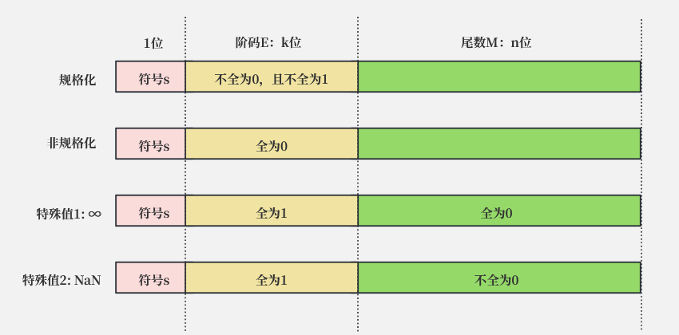

# 浮点数的标准

自计算机发明以来, 曾出现许多中不同的浮点数表示方式，其中一种方法的思想是将小数分为下面三部分：

* 正负号
* 基础数值
* 小数点位置

>  注意这个思想与具体的实现（例如进制）无关

例如浮点数 $3.14$和 $31.4$，它们的“基础数值”相同（都是 $314$），不同的只是小数点位置。理解这个之后就不难理解[IEEE754](https://en.wikipedia.org/wiki/IEEE_754)标准了，它将浮点数的信息划分为3部分，分别是：

$$V =  (-1)^s  \cdot M  \cdot 2^E$$  

* $(-1)^s$ 表示正负号，当$s=0$时浮点数的值为正， $s=1$时为负。
* $M$ 表示基础数值，它是一个2进制的小数，值域为：
  * $[1,2-ε]$（规格化时）或
  * $[0,1-ε]$（非规格化时）

* $2^E$ 表示小数点位置（当$E>0$时候小数点向右移动，反之向左移动），

在计算机系统中， $s、M、E$通过以下长度的编码表示： 

*  $s$：用 $1$个bit表示，下文称 $s$为『**符号**』
*  $E$：用 $n$个bit表示，下文称 $E$为『**阶码**』
*  $M(mantissa)$：用 $k$个bit表示，下文称 $M$为『**尾数**』

> 注意：这里仅仅是 $s$、 $M$、 $E$ 的编码方式，不是 $V$的计算方式，甚至不是公式中对应部分（基础数值，小数点位置）的具体计算方式

 

从广义上来说， $k$和 $n$上它们可以为任意正整数（如果机器支持的话），由此看出这个标准的优雅之处：**不依赖特定平台，但是在任意平台上的计算规则完全一致**。

IEEE754对 $k$和 $n$做出了一些限制，从而形成了几种不同的浮点数表示方式，这些方式的区别只是 $k$和 $n$的值稍有不同，其解析、计算方式是完全一致的。

| 类型                                                         | 总长度 | $s$的值 | 阶码 $E$的位数（$n$ 的值） | 尾数 $M$的位数（ $k$的值） |
| ------------------------------------------------------------ | ------ | ------- | -------------------------- | -------------------------- |
| 半精度                                                       | 16     | 1       | 5                          | 11（有10位被显式存储）     |
| 单精度                                                       | 32     | 1       | 8                          | 23                         |
| 双精度                                                       | 64     | 1       | 11                         | 52                         |
| [quadruple precision ](https://en.wikipedia.org/wiki/Quadruple-precision_floating-point_format) | 128    | 1       | 15                         | 113（有112位被显式存储）   |
| [octuple precision](https://en.wikipedia.org/wiki/Octuple-precision_floating-point_format) | 256    | 1       | 19                         | 237（有236位被显式存储）   |

本文只关注单精度和双精度。

***

# 具体的编码方式

IEEE754的浮点数标准分为3种情况，分别是规格化、非规格化、特殊值（又细分为两种情况），如下所示

## 规格化
当尾数部分既不全为0，也不全为1时，浮点数采用规格化的方式计算，此时：

### 尾数：$M = 1+frac$

其中 $frac$是一个这样的小数 $0.f_1f_2..f_n$  ， 即： $frac=  \sum_{i=1}^{n}{2^{-i}  \cdot f_i}$  

### 阶码：$E = e - Bias$ 

其中 ：

*  $e = e_1e_2...e_k = \sum_{k=1}^{n}{2^{k-1}  \cdot e_k}$
*   $Bias= 2^{k-1}-1$（可见 $Bias$是一个固定值，跟 $k$的取值有关）

即最终值为:

$$
\begin{equation}
\begin{aligned}
V &=  (-1)^s  \cdot  M  \cdot  2^E \\
&= (-1)^s  \cdot  (1+frac)  \cdot  2^{e - Bias} \\
\end{aligned}
\end{equation}
$$

## 非规格化
当尾数部分全为0，此时：

### 尾数： $M = frac$

其中 $frac$ 的计算方式同规划化

### 阶码： $E = 1 - Bias$

>  **注意 $M$ 和 $E$ 跟规格化的时候的差异，下面会解释这种差异的原因** 

即最终值为:

$$
\begin{equation}
\begin{aligned}
V &=  (-1)^s  \cdot  M  \cdot  2^E \\
&= (-1)^s  \cdot  frac  \cdot  2^{1 - Bias} \\
\end{aligned}
\end{equation}
$$

## 特殊值
* 无穷大
当尾数全为1，阶码全为0时候，表示无穷大，根据$s$的不同可以分为$+\infty$和$-\infty$
* NaN
当尾数全为1，阶码却不全为0时候，表示NaN（not a number）

***

# 几个问题
* 非规格化的时候$M=f , E=1-Bias$的意义是什么，为何这样做 
* $Bias= 2^{k-1}-1$怎么理解 

要解答这个问题，就先要理解浮点数设计的一些目的，浮点数在设计之初就有以下两个目的:
* 平滑过渡
* 能够使用整数排序函数进行排序

下面以大于0的浮点数（即$s=0$）作为例子，推理过程也适用于小于0的浮点数。

## 关于平滑过渡
任意两个相邻的无符号整数的差是1，因此整个序列的值是逐渐平缓递增的。
浮点数的也有相似属性，现在假设有3个相邻的规格化的浮点数$a ，b ，c，其中c>b>a>0$，**且$a$和$b$处于同一阶码**（即$a$到$b$不会产生进位到阶码），**$b$和$c$处于不同的阶码**，

根据上面规格化的浮点数计算公式，$b-a$的差为:

$\begin{equation}
\begin{aligned}
&b-a\\
&=(-1)^s  \cdot (1+{frac}_b)  \cdot 2^{e_b - Bias} - (-1)^s  \cdot (1+{frac}_a)  \cdot 2^{e_a - Bias} \\
&=(-1)^s  \cdot 2^{e_b - Bias} \cdot (1+{frac}_b-1+{frac}_a)\\
&= (-1)^s  \cdot 2^{e_b - Bias} \cdot({frac}_b-{frac}_a)
\end{aligned}
\end{equation}$

因为$ab$是相邻的，所以${frac}_b-{frac}_a = ε(ε=2^{-k})$，则差最终为

$\begin{equation}
\begin{aligned}
b-a & = (-1)^s  \cdot 2^{e_b - Bias} \cdotε\\
  & = (-1)^s  \cdot 2^{e_b - Bias -k} ①
\end{aligned}
\end{equation}$

当$bc$处于不同的阶码时，即$b$到$c$会产生进位到阶码，此时$b$的尾数必定全为1（只有这样$b$的尾数再继续递增才能产生进位到阶码），$c$的尾数全为0，并且$b$的阶码比$c$的阶码小1（进位到阶码的缘故）。此时差为

$\begin{equation}
\begin{aligned}
&c-b\\
&=(-1)^s  \cdot (1+{frac}_c)  \cdot 2^{e_c - Bias} - (-1)^s  \cdot (1+{frac}_b)  \cdot 2^{e_b - Bias} \\
&=(-1)^s  \cdot (1+0)  \cdot 2^{e_b+1 - Bias} - (-1)^s  \cdot (1+(1-ε))  \cdot 2^{e_b - Bias} \\
&=(-1)^s  \cdot 2^{e_b - Bias + 1} - (-1)^s  \cdot (2 - ε)  \cdot 2^{e_b - Bias} \\
&=(-1)^s  \cdot 2^{e_b - Bias} \cdot(2-2+ε)\\
&=(-1)^s  \cdot 2^{e_b - Bias -k}            ②
\end{aligned}
\end{equation}$

比较①②可知，**规格化浮点数之间确实存在像整数那样的平滑过渡**。如果$abc$是非规格化的，模仿上面的过程推算，容易得知：

$b-a = (-1)^s  \cdot 2^{1 - Bias -k}$ ③

$c-b = (-1)^s  \cdot 2^{1 - Bias -k}$ ④

比较③④可知，**非规格化浮点数之间确实存在像整数那样的平滑过渡**

那么非规格化和规格化之间是否也是平滑过渡呢？对于最大的非规格化浮点数，它的尾数全为1，阶码全为0，则根据公式它的值为

$\begin{equation}
\begin{aligned}
v
&=(-1)^s  \cdot frac  \cdot 2^{1 - Bias}\\
&=(-1)^s  \cdot (1-ε)  \cdot 2^{1 - Bias} ⑤
\end{aligned}
\end{equation}$

对于最小的规格化浮点数，它的阶码为1，尾数全为0，则根据公式它的值为

$\begin{equation}
\begin{aligned}
v
&= (-1)^s  \cdot (1+frac)  \cdot 2^{e - Bias} \\
&= (-1)^s  \cdot 1  \cdot 2^{1 - Bias}\\
&= (-1)^s  \cdot 2^{1 - Bias} ⑥
\end{aligned}
\end{equation}$

⑥-⑤可得

$\begin{equation}
\begin{aligned}
v
& = (-1)^s  \cdot 2^{1 - Bias} (1- (1-ε))\\
& = (-1)^s  \cdot 2^{1 - Bias}  \cdot ε\\
& = (-1)^s  \cdot 2^{1 - Bias -k}
\end{aligned}
\end{equation}$

这个结果和③④完全一致，同时和①中的公式也是一致的（因为此时$e_b=1$），说明**规格化和非规格化之间的转换，也是平滑过渡的**。综上我们可以知道，所有的浮点数之间也存在整数一样的平滑过渡。注意这种平滑过渡与整数稍稍不同，两个相邻的浮点数之间的差并不是完全相同，而是遵循着一个计算公式，从上述的推论可以看出来

同时在⑥-⑤的过程中我们可以看到，非规格数的阶码的计算方式定义为${1 - Bias}$，是为了平滑过渡。如果为了跟规格化保持一致则会定义为${0 - Bias}$，这样就会使得整个值无法平滑过渡，因此这就回答了我们第一个问题。

## 关于能够使用整数排序函数进行排序

仔细观察书中的例子，可以发现浮点数的位模式跟整数是一样的，这使得浮点数和整数具有同样的单调性，所有对整数使用的排序程序也能用在浮点数上面，只要把浮点数当成整数解析则可。

## 关于阶码$E$
阶码决定着小数点左右移动，对于规格化的小数，我们希望小数点左右移动能够均衡，这样子的话能够表示的数字的范围就更加广且均衡。因为$e$的范围是$[0, 2^{k}-1]$，因此将$Bias$定义为$2^{k-1}-1$，将会使$e-Bias$的范围为$[-2^{k-1}+1, 2^{k-1}]$，这样就使得小数点左右移动的范围比较均衡。

对于非规格化的小数，情况稍微有点不同，$E=1-Bias=2-2^{k-1}$为一个定值且小于0（意味着非规格化的浮点数永远小于1），此时小数点是固定的，它这样做的目的是为了表示那些非常接近0的小数，同时会使得$(-1,1)$之间的数字会很密集（有利于精确表示小于1的小数）。

这就回答了我们的第二个问题。

***

# 一个使用JavaScript解析小数的例子
这是一个手动计算浮点数值的例子,点击[这里](parse_float.md)查看