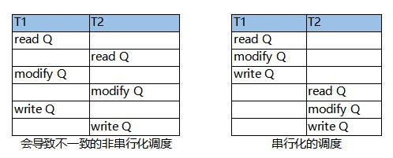
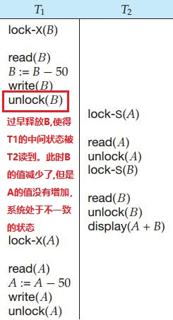

# 并发控制机制
并发控制的目的是为了保证事务的隔离性，从而实现一致性。常用的并发控制机制有：
* 基于锁的协议
* 基于时间戳的协议
* 基于有效性检查的协议
* 多版本并发控制（MVCC）
* 快照隔离

在理解这些机制时候，都可以用1个简单的并发场景来检验：    
$T_1$和$T_2$并发对数据$Q$进行读取、修改、写入。此时有多种调度的可能（如下图），数据库通过采用我们介绍的并发控制机制，可以保证只生成串行化的调度，从而保持一致性。  
 -->

> 注意：并发控制所有机制，最终的目的都是实现**在一个事务内，它所访问的所有数据都是一致的，即数据都是基于某一个一致的状态而来。如果达到了这个要求，则从宏观上来看事务是串行的**。


## 锁
基于锁的协议思路是：独占数据，期间**不允许其它事务访问数据**（注意这个是区分基于锁的协议与其它协议的一个重点），这属于一种系统强行串行并发访问同一数据的所有操作。  

有两种基于锁的协议，分别是二阶段封锁协议和基于图的封锁协议。

### 二阶段封锁协议
如果事务对资源的封锁不适当，就不能保证一致性，例如以下的例子，因为$T_1$过早地释放了锁，使得事务出现了不一致。例如：  


二阶段锁协议是一种通用的封锁方式，它规定事务对资源的封锁/解锁分为两个阶段  

* 增长阶段：只能申请锁不能释放锁
* 缩减阶段：只能释放锁不能申请锁  

从这个做法可以看到，一旦进入缩减阶段，就意味着事务对所有的数据都已经使用完毕（因为不能再申请锁了，若再申请就违反了二阶段协议），从而保证事务过程中所需的数据不会被提前释放，这种做法在基于锁的多线程并发编程中或许也适用。

### 严格二阶段封锁协议
二阶段封锁协议的一个变种，它在原协议的基础上增加了约束：事务提交前**不可释放排他锁**，这个约束避免了级联回滚。

### 强二阶段封锁协议
二阶段封锁协议的又一个变种：它在原协议的基础上增加了约束：事务提交前**不可释放锁**。

注意二阶段锁协议不能保证没有死锁。

### 基于图的封锁协议（略）
### 避免死锁（略）
### 死锁的检测和恢复（略）
## 多粒度（略）


---

## 时间戳

时间戳的思路是：**不锁定数据，如果在我开启之后没有其它事务读/写过数据，则我对数据的读/写是安全的（所有数据都属于同一状态），不会影响其它事务。若有，则当前事务的操作是不安全的，需要回滚。**  这种方式系统没有强行串行对数据的并发访问，而是筛选出不符合串行化要求的操作，并终止它们。

* 每个事务开启的时候都有一个时间戳，记为$TS(T_n)$
* 每个数据项Q都有两个时间戳，分别是读时间戳$R(Q)$和写时间戳$W(Q)$。
* 当事务先后开启，则事务的时间戳决定了事务的串行化顺序，系统必须保证这个串行化的顺序。

具体如下操作  

* 当$T_1$读的时候：
    * 如果$TS(T_1)<W(Q)$（说明有另外一个事务在$T_1$开启之后更新过数据Q），则回滚。否则读取$Q$并更新$R(Q)$=$TS(T_1)$。注意：Read操作不检查$R(Q)$，说明允许多个事务同时读取同一个数据。
* 当$T_1$写的时候：
    * 如果$TS(T_1)<R(Q)$（说明有另外一个事务在$T_1$开启之后读取过数据，若$T_1$继续写入，**会导致之前的事务读取了一个无效的数据**），则回滚。
    * 如果$TS(T_1)<W(Q)$（说明有另外一个事务在$T_1$开启之后更新过数据，若$T_1$继续写入，**会覆盖之前事务的结果**），则回滚。因为该协议没有对Q进行加锁。
    * 如果上述两种情况都不发生，则写入$Q$并令$W(Q)$ = $TS(T_1)$


### Thomas写规则  

在原始时间戳协议中，如果某条指令导致回滚，但是此时如果满足某些条件的话可以不回滚，只需要忽略指令，略。

---
## 基于有效性检查的协议

有效性检查的思路是: 认为并发事务的大多数操作都是不冲突的Read操作，因此无需对数据上锁，只需在写入数据的时候进行有效性检查即可，如果通过检查即意味着数据在此期间没有被修改过，可以直接提交，否则回滚。

类似于CPU的CAS指令，它预期大部分时间事务不会发生冲突，通过检查来确定。
在这个协议中，事务分为三个阶段：

* 读阶段，用时间戳$S(T_n)$标记该阶段开始时间，这个阶段内事务把数据库的数据读取到本地局部变量，然后对局部变量进行修改。  
* 检查阶段，用时间戳$V(T_n)$标记该阶段开始时间，这个阶段内事务将按照一定的规则对Write操作进行检测，通过监测进入下一阶段，否则回滚。
* 写阶段，用时间戳$F(T_n)$标记该阶段结束时间，这个阶段内事务将提交数据（只读事务将忽略这个阶段）

在检查阶段中，事务$T_1、T_2$（不妨假设$T_1$先于$T_2$进入）必须要满足以下两个条件之一，否则终止事务

* $T_1 T_2$按照这样的顺序进行：$F(T_1) < S(T_2)$  
    这个情况意味着事务的执行没有重叠，不存在并发问题。

* $T_1 T_2$按照这样的顺序进行：$S(T_2) < F(T_1) < V(T_2)$，且 **$T_1$写的数据和$T_2$读的数据没有交集**（为方便讨论以下简称这个为约束①）。  
    这个情况意味着事务并发执行，但是事务间处理的数据没有出现交集。可以分两步来解读这个条件  
    * $T_1$写的数据和$T_2$读的数据没有交集 ： 因为没有交集，保证了$T_2$后续处理的数据都不会受到$T_1$的影响，因此$T_2$的数据自然是一致的。
    * $S(T_2) < F(T_1) < V(T_2)$ ： $T_1$读的数据和$T_2$写的数据可能会有交集也可能没有交集，但是即使有交集也没有问题，因为$T_2$在$T_1$结束后才对公共数据进行修改，因此$T_1$在整个事务过程中的数据也是一致的。

仔细比较，这个协议跟时间戳协议似乎是等价的。满足有效性检查事务$T_1、T_2$，同时也满足时间戳协议，例如：
* 对于事务$T_1$，用时间戳协议检查的过程是：    
    读：条件$S(T_2) < F(T_1) < V(T_2)$，使得$T_1$的Read操作满足时间戳协议  
    写：约束①使得$T_1$的Write操作满足时间戳协议  
* 对于事务$T_2$，用时间戳协议检查的过程是：    
    读：约束①使得$T_2$的Read操作满足时间戳协议  
    写：约束①使得$T_2$在$V(T_2)$阶段的Write操作满足时间戳协议（即使$V(T_2)$会修改$T1$读取的数据，但是这没有关系，因为此时$T_1$已经结束了，在$T_1$的整个生命周期内，它所操作的数据都是一致的。）  
    

总结起来就是：**$T_2$结束的时候，$T_1$没有修改过它们之间共同访问的数据，且$T_2$修改的数据，不是它们之间的公共数据**


## 多版本并发控制（MVCC）
MVCC的思路是：**不直接修改数据$Q$的原始值，而是增加一个新的版本，这样就保证了所有事务对数据$Q$的读取都是没有问题的**。  

它和时间戳协议有一些相似的地方：

* 每个事务开启的时候都有一个时间戳，记为$TS(T_n)$
* 每个数据项$Q$都有多个版本，分别为$Q_1 Q_2 ... Q_{n-1}$。 $Q_{n-1}$有两个时间戳，分别是读时间戳$R(Q_{n-1})$和写时间戳$W(Q_{n-1})$。
* 当事务$T_n$创建$Q$的新版本的$Q_n$的时候，会令$R(Q_n)=W(Q_n) = TS(T_n)$

具体操作如下：
* 当事务对$Q$进行读/写，选择$max\{W(Q_n)<=TS(T_n)\}$的那个版本，即写时间戳最为接近$TS(T_n)$的那个版本。
* 如果是Read操作，则更新$R(Q_n) = TS(T_n)$，并返回数据的值
* 如果是Write操作
    * 若$TS(T_n) < R(Q_n)$（表明有事务在我开启之后读取了数据，与时间戳协议类似），则回滚
    * 若$TS(T_n) = W(Q_n)$（表明上一次对数据的读写也是当前事务），覆盖$Q$的值
    * 若$TS(T_n) > W(Q_n)$ ，则创建一个新的版本$Q_{n+1}$
>$TS(T_n) < W(Q_n)$在这里没有讨论，因为根据第一步的规定，这是不可能出现的，请思考为什么


## 快照隔离和MVCC的关系

* MVCC不止给快照隔离用，**RC、RR 隔离级别全靠 MVCC**
* MVCC是底层实现技术，快照隔离是除了四大事务隔离级别外，数据库厂商自己提出的一种新的隔离级别，位于RR和RC之间，并不是SQL标准。


> 问：
>
> 多版本在事务并发的时候是怎么体现的呢？当某个时刻去查询数据库，返回的的某一条数据只有一个版本，不会有多个版本的
>
> 
>
> 答：
>
> 这是**99% 学数据库的人最疑惑的点**，我用**超级通俗、完全贴合底层**的方式给你讲透，一次性解决：
>
> ------
>
> ## 核心一句话先定调
>
> 1. **数据库物理层：永远存在多个版本**
> 2. **你查询时：只会看到「符合你事务规则的那一个版本」**
> 3. 多版本是**底层隐藏存档**，用户永远只看 “筛选后的唯一结果”
>
> ------
>
> # 一、先搞懂：数据实际长什么样（InnoDB 为例）
>
> 假设原始数据：
>
> ```plaintext
> name=张三  age=20   版本号v1
> ```
>
> 事务 A 修改了 age=25，但**不直接覆盖旧数据**：
>
> - 新增一条 **新版本 v2**
> - 旧版本 v1 **保留在 undo log 里**
>
> 此时这条数据在库里**物理上有两条**：
>
> - v1：张三 20（旧版本，历史快照）
> - v2：张三 25（当前最新）
>
> 👉 **数据是多版本并存的，只是你看不见全部**
>
> ------
>
> # 二、为什么你查永远只返回 1 条？
>
> 因为：**MVCC 有一套「版本筛选规则」**每次 SELECT 时，自动过滤掉不该你看的版本，只留**合法那一条**。
>
> ### 筛选逻辑极简版
>
> 每条数据版本都有两个隐藏字段：
>
> 1. `trx_id`：生成这条版本的事务 ID
> 2. `roll_ptr`：指向**上一个旧版本**
>
> 查询时数据库会做两件事：
>
> 1. 拿到**当前事务的快照视图**
> 2. 从「最新版本」开始往前回溯版本链
> 3. 跳过：未提交的、晚于我开启的事务版本
> 4. **找到第一条「我有权限看到的版本」返回**
>
> ------
>
> # 三、举个实战场景，秒懂
>
> ### 场景
>
> - T0：初始数据 v1（age=20）
> - 事务 B（写事务）：更新为 age=25，生成 v2，未提交
> - 事务 A（读事务）：正常查询
>
> ### 底层真实情况
>
> ```plaintext
> v2(age=25) ← v1(age=20)
> ```
>
> ### 事务 A 查询过程
>
> 1. 先看最新 v2：
>
>    发现是未提交事务产生的 → 不能看
>
> 2. 顺着版本指针找上一级 v1：
>
>    已提交、合法 → 返回 v1
>
> ✅ 你最终只看到 20
>
> ✅ 底层其实有 v1、v2 两个版本
>
> ------
>
> # 四、不同隔离级别，就是「筛选规则不一样」
>
> ### 1. 读已提交 RC
>
> - 每次查询**重新生成快照**
> - 别人提交了，你下次就能看到新版本
>
> ### 2. 可重复读 RR（MySQL 默认）
>
> - 事务**第一次查询固定快照**
> - 无论别人怎么改、怎么提交，你永远看旧版本
>
> ### 3. 快照隔离 SI
>
> - 事务启动瞬间全局快照
> - 全程卡死这个时间点的版本
>
> ------
>
> # 五、回答你最关键的疑问
>
> ### 问题 1：既然多版本，为什么我查出来只有一条？
>
> > 多版本是**底层存储形态**上层 SQL 查询会自动**过滤版本链**只展示**当前事务隔离级别允许你看到的那一行**
>
> ### 问题 2：那多版本并发是怎么体现的？
>
> - 写操作：**不改旧数据，只加新版本**，不阻塞读
>
> - 读操作：**直接读历史版本**，不加锁
>
> - 读写完全并行，互不阻塞
>
>   这就是 MVCC 并发能力的来源
>
> ### 问题 3：旧版本什么时候删掉？
>
> 后台有 **purge 线程**当没有任何事务再需要旧版本时，自动清理 undo log，回收空间。
>
> ------
>
> # 六、终极极简总结
>
> 1. 物理存储：**一行数据 = 一条版本链表**，多版本真实存在
>
> 2. 用户查询：**按隔离级别做版本过滤**，永远只返回 1 条
>
> 3. MVCC 并发本质：
>
>    写 = 追加新版本
>
>    读 = 回溯读旧版本
>
>    读写互不阻塞
>
> 4. 四大隔离级别（RC/RR），全靠**修改版本过滤规则**实现


参考

* [mysql隔离性结合case详细分析；一文掌握RR和RC的MVCC底层原理；四种隔离级别区别](https://zhuanlan.zhihu.com/p/412862034)