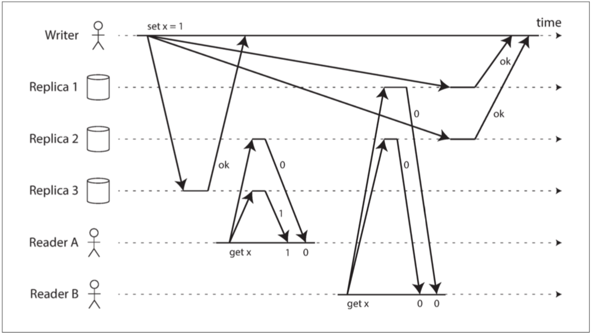
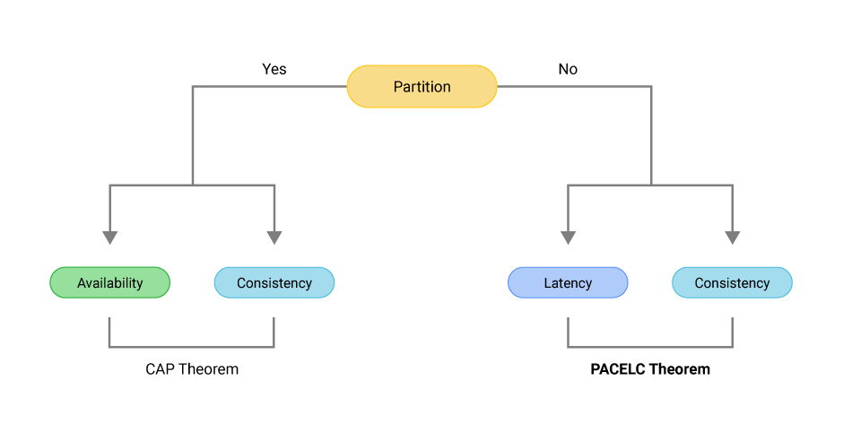
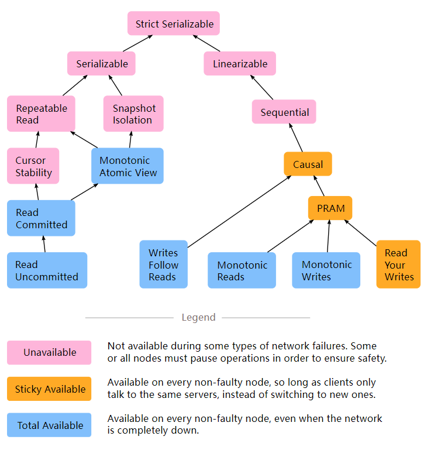
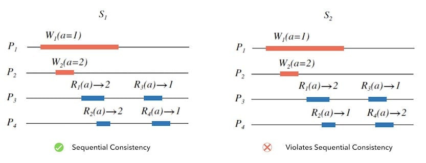
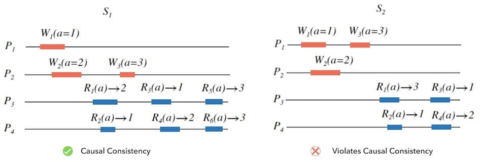
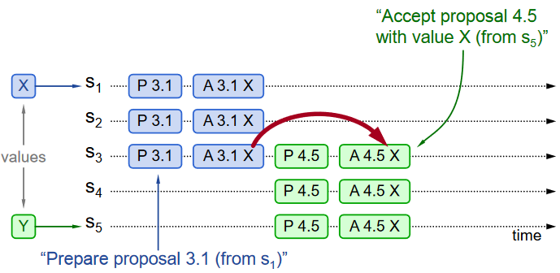
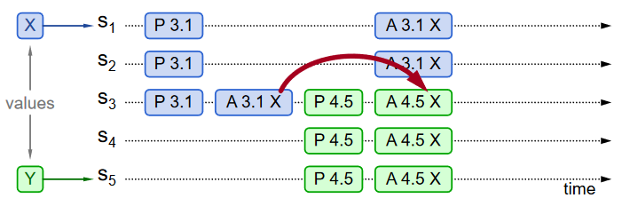
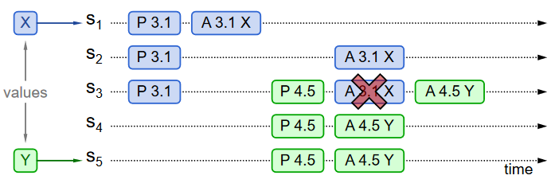

# 1. 认识分布式系统

* 特点：
  * **不共享时钟：难以通过时间来定义两个事件的顺序**
* 好处：
  * 高性能：提供大量的计算存储能力
  * 扩展性
  * 高可用：通过冗余数据或者计算实现
* 挑战：
  * 网络不可靠：消息会**丢失**、**迟到**、**重复**、**乱序**（TCP能从一定程度上处理这些问题，提供一个可靠连接的抽象）
  * 部分失效：操作缺少原子性
  * 时钟问题：

* 一些意外的结论：
  * 从远程服务器内存中读取数据要比直接从磁盘上读取要快？

# 2. 分布式系统的模型

## 系统模型

根据不同类型的故障抽象出不同的系统模型，分别有：

* 按照网络链路划分：

  |              | 不丢失 | 不重复 | 有序 | 不无中生有 |
  | ------------ | ------ | ------ | ---- | ---------- |
  | 可靠链路     | ✅      | ✅      | ✅    | ✅          |
  | 公平损失链路 | ❌      | ❌      | ❌    | ✅          |
  | 任意链路     | ❌      | ❌      | ❌    | ❌          |

  * 通过**加密传输，可以将3转化为2**（假设攻击者不会阻断链路）
  * 通过**数据重传，可以将2转化为1**（因为2会假设所有**网络分区只会持续有限时间**）
  * 重传是个非常有效的手段，有时候工程上没有完美的解，但可以找到足够可用的解

* 按照故障类型分：

  * 崩溃-停止（crash-stop）：
  * 崩溃-恢复（crash-recovery）：
  * 拜占庭故障（Byzantine）：

  除了航空、加密货币等小部分领域需要拜占庭容错，其它大部分领域使用崩溃模型就已经足够

* 按时间类型划分：

  * 同步：消息的响应时间在一个**有限且已知的范围内**
  * 异步：消息的响应时间是无限的
  * 部分同步：系统在大部分时间内是同步的，但会因为偶尔的故障转变为异步

## 消息传递语义

* 最多一次
* 最少一次
* 精确一次：通过重传实现**精确处理一次**，从而模拟**精确传递一次**

**书中讨论的模型默认是【可靠链路】 +【崩溃-停止/崩溃-恢复】 + 【部分同步】**

# 3. 分布式数据基础

* 分区提供了**扩展性和高性能**
* 复制（即冗余）提供了**高可用**

## 分区（partition）

* 水平分区：即分布式系统中的分片（Shardlng ），在本文的上下文里，**分区和分片是同义词，都是指将数据分布在不同的物理机器上**。
* 垂直分区：不讨论

不同系统中对分区的称呼

> What we call a *partition* here is called a *shard* in MongoDB, Elasticsearch, and SolrCloud; it’s known as a *region* in HBase, a *tablet* in Bigtable, a *vnode* in Cassandra and Riak, and a *vBucket* in Couchbase. **However, *partitioning* is the most established term**, so we’ll stick with that
>
> * *shard*: MongoDB/ Elasticsearch/ SolrCloud:
> * *region*: HBase
> * *tablet*: Bigtable
> * *vnode*: Cassandra/ Riak
> * *vBucket*: Couchbase

分区算法有以下几种：

### 范围分区

指根据**指定的关键字（分区键）**将数据集拆分为**若干连续的范围**，每个范围存储到**—个单独的节点上**。

* 优点
  * 实现简单
  * 对分区键进行范围查询，当查询范围较小且落在同一个节点上时性能良好
  * 通过**修改范围的边界**就能够增加或减少该范围的数据，从而达到重新分区均衡负载

* 缺点  

  * 无法使用分区键以外的关键字进行范围查询
  * 查询范围较大且位于多个节点时，性能较差
  * 可能产生数据倾斜（这其实是分区键选择不当造成的）或请求流量不均匀（此时虽然数据均匀分布，但请求流量不均匀，此时需要对热点数据进行拆分）

  

### 哈希分区

将**指定的关键字（分区键）经过—个哈希函数计算**，根据计算得到的值来决定该数据集的分区  

* 优点
  * 分布均匀
* 缺点
  * 不支持范围查找
  * 增删新节点时候会造成数据大规模移动（增删节点以为着要修改原哈希函数，因为一个哈希值就必须有一个节点对应）

### 一致性哈希

是对哈希分区算法的改进

* 优点
  * 增删节点时候不会导致数据大规模调整，只需要调整被增/删节点的相邻节点的数据，且不需要修改哈希函数（优化了上述哈希算法的第二个缺点，有更好的扩展性）
* 缺点
  * 不支持范围查找
  * 删除节点N的时候，N往顺时针方向的下一个节点将会接收N的全部数据，这使得可能会导致数据分布不均。可以使用虚拟节点来缓解这个问题，这样当删除物理节点的时候，如果安排妥当的话，被删节点的数据能够均匀分布到其它虚拟节点（即均匀分布到各个物理节点）

分区的挑战有两个：

* 某些操作需要跨分区访问数据
* 跨分区实现事务

## 复制（Replication）

* 优点：

  * 增强安全性和可用性（多了备份）

  * 增加吞吐量（多了备份，所以可以从分担读的压力）

  * 减少往返时间（从最近的那个备份读取）

* 缺点：增加了系统的复杂性

复制有以下三种类型：

### 单主复制（主从复制）

分为3类：同步复制、异步复制、半同步复制 

* 优点：
  * 简单，容易实现
  * 仅在主节点进行并发的写操作（从节点只需要同步日志文件，是属于线性化后的写操作，不属于并发），能**够保证数据一致性**
  * **对于读操作**，单主复制是可扩展的（通过增加多个从节点）
* 缺点：
  * 写操作集中在主节点上难以扩展（扩展性）
  * 主节点宕机后无法立即切换到从节点，因为数据可能尚未同步到从节点（可用性）

### 多主复制

**应用场景**

在单个数据中心内部使用多个主库的配置没有太大意义，因为其导致的复杂性已经超过了能带来的好处。通常在多个数据中心的情景下使用，通常是：

* 在数据中心内部，使用常规的主从复制

* 在数据中心之间，每个数据中心的主库都会将其更改复制到其他数据中心的主库中

  

#### 处理写入冲突

>  最好的方法就是回避数据冲突，例如让**各个主节点负责不同部分**的数据写入。在这种情况下**主节点之间的数据同步**就退化为单主复制，从节点可以从任意一个主节点同步数据。

常见的解决策略有：

* 客户端决策

* Last Write Win

* 因果关系追踪

* 无冲突数据类型

  

解决写入冲突这部分的内容过于复杂，暂时不深入探讨。

#### **多主复制拓扑**（replication topology）

* 环形
* 星型
* all-to-all

### 无主复制（Dynamo-Style）

#### 核心思想

上述两种基于master的复制算法，其缺点是一旦master宕机了集群就无法写入。无主复制算法克服了这个问题，它写入时候往集群多个节点（可以是全部）发送写请求，一旦若干节点确认写入成功，则认为这个写请求成功。

无主复制关键之处是需要理解Quorum机制下的数据冗余，即理解公式：

$$
W + R > N
$$

它有两层意义：

* **核心思想是读写的节点有重叠**，从而确保写入的最近数据一定被读到
*  $R$ 越小读取性能越好（因为需要读取较少节点）， $W$ 越小写入性能越好（因为需要写入较少节点）

一些需要注意的地方

* **Quorum** 机制，是一种分布式系统中常用的，用来保证**数据冗余**和**最终一致性**（注意只是最终一致性，不能保证更强的一致性了）的投票算法。
* 注意**Quorum不一定是*大多数***（*大多数*是写入时候必须超过一半的节点），Quorum的核心是有**重叠**，这样即使不是大多数的情况下依然能够返回最新数据
* 遵循这些 $R$ 值和 $W$ 值的读写称为 **法定人数（quorum）** 的读和写
* **宽松的quorum实际上并不是法定人数，它能够提供一些容错但会导致系统变得复杂**，不要过于纠结这个概念，关于详细的描述可以参考[宽松quorum和提示移交](https://github.com/Vonng/ddia/blob/master/ch5.md#%E5%AE%BD%E6%9D%BE%E7%9A%84%E6%B3%95%E5%AE%9A%E4%BA%BA%E6%95%B0%E4%B8%8E%E6%8F%90%E7%A4%BA%E7%A7%BB%E4%BA%A4)。

#### 节点故障时的写入

在无主配置中，**不存在故障转移**（因为不需要主节点）。

**读修复和反熵**

当故障节点恢复后重新加入集群，它的数据可能是陈旧的，此时的修复机制有：

1. 读修复（Read repair）：客户端从某个节点读取到陈旧值后，通知该节点进行数据修复
2. 反熵过程（Anti-entropy process）：后台进程不断检测数据差异并修复

 

#### 局限性

在以下情况中该机制也会返回陈旧数据，因此不具备线性一致性

1. 使用宽松的Quorum
2. 并发写入时的冲突
3. 如果写操作与读操作同时发生，**写操作可能仅反映在某些副本上。在这种情况下，不确定读取返回的是旧值还是新值**。
4. 如果写操作在某些副本上成功，而在其他节点上失败（例如，因为某些节点上的磁盘已满），在小于 w 个副本上写入成功。所以整体判定写入失败，但整体写入失败并没有在写入成功的副本上回滚。这意味着**一个写入虽然报告失败，后续的读取仍然可能会读取这次失败写入的值**。
5. 如果携带新值的节点发生故障，需要从其他带有旧值的副本进行恢复，则存储新值的副本数可能会低于 w，从而打破公式的约束
6. 即使一切工作正常，有时也会不幸地出现关于 **时序（timing）** 的边缘情况，我们将在 “[线性一致性和quorum](https://github.com/Vonng/ddia/blob/master/ch9.md#线性一致性和法定人数)” 中看到这点。
7. 难以监控数据的陈旧度

总结来说就是不符合ACID特性（特别是隔离性和原子性没有得到支持），只提供最终一致性。

解读：

1. 个人认为使用宽松的话就背离了该算法的核心了，在传统意义上，宽松的quorum实际上并不是quorum。它只是一个持久性的保证，即数据已存储在某处的 w 个节点。但不能保证 r 个节点的读取能看到它，除非提示移交已经完成
2. 没有定义并发写操作的顺序，非单主复制的算法都存在这个问题，解决冲突方法可以参考*多主复制*中的相关章节，以及下面的*检测并发写入*
3. 注意3和6的区别，6是**不同客户端读到不同数据（不符合一致性）**，3是**单个客户端的读取结果不确定**。
4. 没有原子性导致的，因此不是线性一致性
5. 节点故障的时候，可能会打破 $W + R > N$ 这个约束
6. 同4，因此不是线性一致性。尽管quorum似乎保证读取返回最新的写入值，但在实践中并不那么简单。Dynamo 风格的数据库通常针对可以忍受最终一致性的用例进行优化。你可以通过参数 w 和 r 来调整读取到陈旧值的概率，但把它们当成绝对的保证是不明智的。

 

#### 检测并发写入

这一节是上面的*处理写入冲突*的补充，但没有完全理解一些内容，暂时不深入探讨，后续将所有内容统一到上面的章节。

参考：

* [无主复制](https://github.com/Vonng/ddia/blob/master/ch5.md#无主复制)

## CAP定理

了解CAP的两个关键：

1. 对C的理解
2. 对A和P的精确理解，并区分出它们的不同

### 一致性

C：一个大多数人都会混淆的问题，但现在已经得到精确的定义，即**线性一致性**，在*一致性模型*那一节再仔细讨论。

> 《从0开始学架构》其实并没有解释好一致性

### 可用性

A：对于**任意请求都能得到响应**，意味着即使出现网络分区，**所有节点**（严谨来说是所有非故障节点）都能够**提供服务**。重点有：

1. 任意请求
2. 得到响应（即不能超时，并且结果合理）

《从0开始学架构》中关于A的解读对理解A很有帮助，尤其是对返回结果正确和失败的相关讨论：

> 第一版的 success/failure  的定义太泛了，几乎任何情况，无论是否符合 CAP  理论，我们都可以说请求成功和失败，**因为超时也算失败、错误也算失败、异常也算失败、结果不正确也算失败；即使是成功的响应，也不一定是正确的。例如，本来应该返回 100，但实际上返回了  90，这就是成功的响应，但并没有得到正确的结果**。相比之下，第二版的解释明确了**不能超时、不能出错，结果是合理**的，注意没有说“正确”的结果。例如，应该返回 100 但实际上返回了 90，肯定是不正确的结果，但可以是一个合理的结果。

### 分区容忍

P：分区容忍的重点在于出现网络分区之后，系统仍然是可用的（**部分可用**）

**部分可用**指系统此时处于下面两种状态之一：

1. **全部节点**只提供读功能；

2. **部分节**点提供**读写功能**，剩下的节点不可用。

此时并不是对所有请求都能响应，例如1中系统无法正常响应写请求，2则是部分节点完全不可用。

### P和A有什么不同

摘抄一段知乎的答案，

>**分区容忍就是指分布式系统在出现网络分区的时候，仍然能继续运行，对外提供服务。**注意，这里所说的仍然能够对外提供服务跟可用性的要求不一样，可用性要求的是对于**任意请求都能得到响应**，意味着即使出现网络分区**所有节点都能够提供服务**。而分区容忍的重点在于出现网络分区之后，**系统仍然是可用的（包括部分可用）**。
>
>链接：https://www.zhihu.com/question/54105974/answer/2144019181

## PACELC定理

一图胜千言

* 如果P发生了，需要在AC之间做出取舍；
* 否则（**E**lse），需要在延迟性（**L**atency）和一致性之间做取舍。即如果选择一致性，则需要忍受请求的应答有延迟（系统吞吐下降）。如果不希望有延迟（系统吞吐提升），则需要放弃一致性。**注意这个定理的前提是P不会发生，即对系统的读写一定会成功，取舍之处在于是否等待系统对读写的应答**。MongoDB的[write concern](https://www.mongodb.com/docs/manual/reference/write-concern/)和[read concern](https://www.mongodb.com/docs/manual/reference/read-concern/)就是一个很好的例子。

注意，系统对CAP和PACELC是可以自由组合的，例如系统可以选择组合PA + EL，也可以选组合PC + EC，不同的组合代表了系统在P是否发生时的取舍。

参考：

* https://erdengk.top/archives/cap-pacelc-nwr

## 一致性模型

> 为了量化研究分布式系统，jpsen定义了[一系列的基础概念](https://jepsen.io/consistency#fundamental-concepts)，并以此为基础进行讨论，理解好这些概念对后续理解分布式系统非常重要。这些概念中值得留意的有：
>
> * process：是一个逻辑的单线程程序，进行计算和执行操作。它的实现可以跨线程进程/操作系统，甚至物理机节点。但只要它的对外表现和一个单线程无异，则可以称之为process
> * operation：An operation is a **transition from state to state**
> * history：是一系列operation的集合。对于含有一系列operation的集合（下面简称为 $s$ ），按照**不同的规则**将 $s$ 中的元素排列会得到不同的history。
> * Consistency Models：根据history的定义，对于同一个 $s$ 我们有一系列的history，则每个history都有一个与之对应的Consistency Model，即**history是特定规则的外在表现**。注意这个说法和Wikipedia的不太一样，但表达的思想是一样的。

Wikipedia的定义： 

> a **consistency model** specifies a contract between the programmer  and a system, wherein the system guarantees that if the programmer  follows the rules for operations on memory, memory will be [consistent](https://en.wikipedia.org/wiki/Data_consistency) and the results of reading, writing, or updating memory will be predictable。

简而言之，一致性模型是一种规范，如果遵守这些规范，则读写是**可预测的**。关于一致性模型作者认为理解的重点是：

1. 可预测
2. 这个定义广义的，不仅仅局限于分布式系统，单机内的多线程也有一致性这个概念
3. 本质上定义了**并发的写操作**的**顺序性**和**可见性**

常见的分布式系统的一致性模型有以下几种，注意他们的颜色和的层次结构：

* 相同的颜色表示相同的可用性
* 箭头表示包含关系
* 一致性从上到下越来越弱

**以数据为中心的一致性**：考虑多个客户端时系统的状态

* 线性一致性： 要求达成事件顺序的**全序**一致， 且和物理时钟上的事件顺序一致。

* 顺序一致性： 要求达成事件顺序的**全序**一致。

* 因果一致性： 要求达成事件顺序的**偏序**一致，不必协调因果无关事件的顺序。

**以客户端为中心的一致性**：聚焦单个客户端观察到的系统状态

* 单调读
* 单调写
* 读你所写
* PRAM：包含上述3个一致性模型的特性

下面会讲述这些一致性模型的定义和特点，但**不包含具体的实现**

### 背景知识：事件先后和并发

> ###  事件先后和并发
>
> 在进一步讨论这些一致性模型之间，需要先了解全序和偏序关系[[2\]](https://writings.sh/post/cap-and-consistency-models#footnote-2)。
>
> 偏序和全序是序理论中常用的两种序关系， 举例来说：
>
> - 自然数之间的大小关系是全序关系，因为所有数字都可以相互比较。
> - 集合之间的包含关系则是偏序关系，因为并不是所有集合都有包含关系。
> - 复数之间的大小关系就是偏序关系，复数的模之间的关系是全序关系。
>
> 简短说： **偏序是部分可比较的序关系，全序是全部可比较的序关系** 。 关于全序和偏序更多的信息，可以看这里：[逻辑时钟-如何刻画分布式中的事件顺序#全序和偏序](https://writings.sh/post/logical-clocks#全序和偏序)。
>
> 在分布式系统中， 事件的先后关系通常用「happened before」的关系符， 比如 $W1→W2$
>
>  表示 $W1$ 在 $W2$ 之前发生。 如果两个事件无法比较先后，我们说两个事件是并发的， 记作 $W1∥W2$ 。
>
> 假设节点之间的物理时钟是精确对齐的， 那么我们完全可以根据事件发生的时间戳来判定事件先后关系。 这就是一种全序关系。 然而因为网络延迟的不确定， 时钟精确同步的这种假设是不符合现实情况的。
>
> 不同的分布式协调算法，对事件先后的判定逻辑也是不同的。 但是我们一定知道**以下先后关系是确定的**：（注意这两条相当重要，后面因果一致性里面还会用到）
>
> - 节点内的事件先后顺序
> - 一次更新的读成功一定发生在写成功之后
>
> 观察下面图7.1， 我们可以推导出来一些先后关系和并发关系。
>
> 
>
> 图7.1 - 事件先后示意
>
> 
>
> 在分布式的事件顺序的理解上，我们一定要清楚的是： **事件的先后关系是具有相对性的**。 我们无法在系统中创造一个上帝视角观察到全局情况， 只能通过每个节点对系统的局部感知来推导全局的事件顺序是怎样的， 这取决于我们的一致性协调算法是如何构建的， 而且我们甚至可能无法推导出全序关系， 只能推导出部分事件的偏序关系。 （了解更多可以看 [逻辑时钟-如何刻画分布式中的事件顺序#事件先后的相对性](https://writings.sh/post/logical-clocks#事件先后的相对性)）。

### [线性一致性](https://jepsen.io/consistency/models/linearizable)

**非严格定义**：

原子操作，系统像单节点，因此也叫原子一致性。

---

**严格定义**（来源于[这里](https://jepsen.io/consistency/models/linearizable)提及的论文）：

1. 将发生在系统上的**所有事件**抽象为一个**并发程序执行历史**，简称为H
2. 给定一个H
3. 根据不同的规则，可以将H解析为不同**与其等价的**的**顺序历史（sequential history  ）**，
4. **只要从中找到一个合法的顺序历史S**，则H符合线性一致性

> a **linearizable history H** is one in which **there is an equivalent sequential (e.g. non-concurrent) history S**, and the partial real-time order of operations in H is consistent with the total order of S, and which preserves the objects’s single-threaded semantics.

将H转为S的规则

1. 如果两个操作是顺序关系，则他们的先后顺序必须保持
2. 如果两个操作是并发关系，则他们可以按照任何顺序排列

如何判断S是否合法？

1. S中**操作的顺序**必须和**全局时钟下的顺序一致**
2. S中**对某个数据的读操作，必须读取到对该数据最近一次的写入**

DDIA中对上述定义做了概括：

> 这就是线性一致性背后的直觉。正式的定义【6】更准确地描述了它。**通过记录所有请求和响应的时序，并检查它们是否可以排列成有效的顺序**，以测试一个系统的行为是否线性一致性是可能的（尽管在计算上是昂贵的）【11】。

DDIA还指出：

> 在一个线性一致的系统中，我们可以想象，在 `x` 的值从 `0` 自动翻转到 `1` 的时候（在写操作的开始和结束之间）必定有一个时间点。因此，如果一个客户端的读取返回新的值 `1`，**即使写操作尚未完成，所有后续读取也必须返回新值**。

---

**通俗的定义**（来源于下面的参考3）：

> 1. 任何一次读都能读到某个数据的最近一次写的数据。
> 2. 要求系统中的所有节点看到的事件顺序，都和全局时钟下的顺序一致。
>
> 简而言之， **线性一致性要求所有节点达成和物理时钟顺序一致的全序一致** 。

线性一致性的几种实现方法：

1. 单主复制：**可能（potential）** 是线性一致性的，因为这个算法依赖于主节点，一个节点很可能会认为它是领导者，而事实上并非如此。
2. 多主复制：非线性一致
3. 无主复制：**也许不是线性一致的**，但通过牺牲性能，可使其线性化：读取者必须在将结果返回给应用之前，同步执行读修复，并且写入者必须在发送写入之前，读取法定数量节点的最新状态（感觉这样也不行呀，只有读取整个集群全部副本数据才能实现线性一致？）。
4. 共识算法：可以安全地实现线性一致性存储

线性一致性的最大困难**是需要一个全局时钟**

参考：

1. https://jepsen.io/consistency
2. [第九章：一致性与共识](https://github.com/Vonng/ddia/blob/master/ch9.md#%E7%AC%AC%E4%B9%9D%E7%AB%A0%E4%B8%80%E8%87%B4%E6%80%A7%E4%B8%8E%E5%85%B1%E8%AF%86)
3. [分布式的 CAP 定理和一致性模型](https://writings.sh/post/cap-and-consistency-models)，强烈推荐，里面的*事件先后和并发的*的解释非常重要
4. [逻辑时钟 - 如何刻画分布式中的事件顺序](https://writings.sh/post/logical-clocks)

###  

### 顺序一致性

**定义：**

> 1. 任何一次读都能读到某个数据的最近一次写的数据。 *(和线性一致性的第一条一样)*
>
> 2. 所有进程看到事件顺序是合理的，可以达成一致即可，并不要求所有进程看到事件顺序和全局物理时钟上的事件顺序一致。
>
>    
>
> 可以看到，顺序一致性是在线性一致性的基础上有一定的弱化：
>
> 1. 这点不变：**所有节点**对事件顺序仍然要达成一致的**全序关系**[[2\]](https://writings.sh/post/cap-and-consistency-models#footnote-2)。
>
> 2. 不同在于：这个全序关系**不必要和实际全局物理时钟**上的事件顺序一致。
>
>    
>
> 对于并发请求， 顺序一致性只要求协调出一个**所有节点都一致的顺序**即可，而**不要求这个顺序一定符合物理时间上的真实顺序**。

**这个模型使得错的话一起错，对的话一起对**。

例子： 

  

*   $S_1$ 满足顺序一致性但不满足线性一致性，因为在全局时钟下 $W_2→W_1$ ，而因果一致性下则要求 $W_2→W_1$ 。

*  $S_2$ 则不满足因果一致性 

### 因果一致性

**定义：**

> 因果一致性是一种最终一致性，在顺序一致性的基础上，进一步弱化了约束：
>
> 1. 不再要求：**所有节点**看到一致的全序关系。
> 2. 只要求：**节点间因果相关的事件顺序要达成一致**。
>
> 什么是「因果相关」呢？ 就是前面我们**偏序中所讲的事件先后关系**， **并发的事件则因果无关**。 对于不同的一致性协调算法， 因果相关取决于具体的算法设计。 同样，无论协调算法如何设计，我们仍然一定有前面那两条因果判断：
>
> - 节点内的事件之间一定有先后顺序
> - 一次更新的读成功一定发生在写成功之后
>
> ......
>
> 关于因果一致性，我认为最重要的一个特征是，**因果一致性要求构建的是偏序，不是全序**。 著名的向量时钟算法[[2\]](https://writings.sh/post/cap-and-consistency-models#footnote-2)，就是一种符合因果一致性协调算法， 算法的核心则是构建偏序关系的向量来描述事件顺序。

例子： 

*   $S_1$ 满足因果一致性，$P_3$ 和 $P_4$ 对因果相关的事件的排序是一致的（读取$a$ 的值时候，必须先读到2然后才能读到3，因为有 $W_2→W_3$）。而因果无关的事件（例如 $W_1$ 对于$W_2和W_3$ 来说就是因果无关）则无法判断顺序。反映了因果一致性构建的是偏序不是全序。

*  $S_2$ 则不满足因果一致性 

### 以客户端为中心的一致性

* 单调读（monotonic read）：简单来说即保证客户端不会读到旧值（不会时光倒流）

* 单调写（monotonic write）：同一个客户端的写操作，在**所有副本上都以相同的顺序执行**

* 读你所写：

* PRAM（pipeline RAM）：具备上述三种性质的一致性模型，即同一个客户端的多个读写，将被所有副本按照同样的执行顺序观察到，但不同客户端发出的写操作可以以不同的执行顺序被观察到。
* 读后写（write follow read）：即会话一致性

## 隔离级别

略

## 一致性和隔离级别的对比

略

# 4. 分布式共识

为何需要共识算法？这是因为：

1. 为了解决第一章中提及的分布式系统的各种问题，我们引入了状态机复制（State Machine Replica），**因为SMR具备实现容错和一致性的理想特性：确定性**。
2. 为了实现SMR，我们需要多副本日志（Replicated Log）
3. 为了实现多副本日志，我们需要共识算法，这个算法使得每个副本对**日志的值和顺序达成共识**。

共识算法需要具备的3个性质：

* 终止性（Termination）：最终，所有正确的进程最终都会认同**某一个值**（注意这里**没有说每个进程认同的值都相同**）
* 协定性（Agreement）：所有正确的进程都认同**同一个值**
* 完整性（Integrity）：如果正确的进程都**提议**同一个值$v$（注意区分提议的值和最终决定值） ，那么任何正确的进程的**最终决定值**一定是$v$ （暗示决定值一定源于某个正确进程的提议，不是凭空产生）

> A consensus protocol tolerating halting failures must satisfy the following properties.
>
> - Termination：Eventually, every correct process decides some value.
> - Integrity：If all the correct processes proposed the same value  v, then any correct process must decide v
> - Agreement： Every correct process must agree on the same value.

这3个性质和后面提及的活性/安全性的关系有点模糊，并且根据FLP定理，似乎活性/安全性更加常用。

## FLP定理

理解这个定理之前需要先知道**安全性**和**活性**的定义：

> Properties of an execution of a computer program—particularly for [concurrent](https://en.wikipedia.org/wiki/Concurrent_system) and [distributed systems](https://en.wikipedia.org/wiki/Distributed_system)—have long been formulated by giving *safety properties* ("bad things don't happen") and *liveness properties* ("good things do happen").[[1\]](https://en.wikipedia.org/wiki/Safety_and_liveness_properties#cite_note-Lamport1977-1)
>
> ...
>
> A safety property proscribes discrete *bad things* from occurring during an execution.[[1\]](https://en.wikipedia.org/wiki/Safety_and_liveness_properties#cite_note-Lamport1977-1) 
>
> ...
>
> A liveness property prescribes *good things* for every execution or, equivalently, describes something that must happen during an execution.[[1\]](https://en.wikipedia.org/wiki/Safety_and_liveness_properties#cite_note-Lamport1977-1)
>
> ...

具体到Paxos协议的话变成这样

>* Safety:
>  * Only a single value may be chosen
>  * A server never learns that a value has been chosen unless it
>    really has been
>* Liveness (as long as majority of servers up and communicating with reasonable timeliness):
>  * Some proposed value is eventually chosen
>  * If a value is chosen, servers eventually learn about it

在最坏的情况下：

1. 一个完全异步的系统
2. 系统中一些节点发生了故障
3. 在1和2的情况下，不可能有一个具备安全性、活性、容错性的共识算法

FLP从理论上说明了在极端的假设下一个完美的共识算法是不存在的，但可以通过破坏前提假设从而设计出一个满足我们需要的共识算法。例如通过创造条件，**使得系统转变为非完全异步**的系统，则在这个基础上我们可以得出一个具备安全性、活性、容错性的共识算法

> Note that Paxos **is *not* guaranteed to terminate, and thus does not have the liveness property**. This is supported by the Fischer Lynch  Paterson impossibility result (FLP)[[6\]](https://en.wikipedia.org/wiki/Paxos_(computer_science)#cite_note-flp-6) which states that a consistency protocol can only have two of *safety*, *liveness*, and *fault tolerance*. As Paxos's point is to ensure fault tolerance and it guarantees safety, it cannot also guarantee liveness.

参考：

* [FLP 不可能原理](https://yeasy.gitbook.io/blockchain_guide/04_distributed_system/flp)
* [Paxos (computer science)](https://en.wikipedia.org/wiki/Paxos_(computer_science)#Safety_and_liveness_properties)
* https://en.wikipedia.org/wiki/Safety_and_liveness_properties

## Paxos

理解Paxos的难点有：

1. `Q4`，如果一开始就带入错误的背景去理解Paxos，则认知会永远处于冲突之中。
2. [《可靠分布式系统-paxos的直观解释》](https://blog.openacid.com/algo/paxos/#%E5%85%B6%E4%BB%96)中用一个简单模型来推导Paxos的过程非常重要，它从最直观的角度解释了Prepare和Accept两个阶段各种行为的根本目的
3. `Q1`+`Q2`+`Q3`覆盖了Prepare阶段的全部问题
4. Prepare阶段的目的：
   1. 找出已经被选中的值（如果有的话）
   2. block之前尚未完成的提议（如果有的话）
5. Accept阶段的目的：
   1. 通知acceptor去接受指定的值

Paxos可能会遇到以下3种异常情况：

**情况1：Previous value already chosen**    

1. 已经选中X
2. 因此后续的proposer一定能发现X，然后采用这个值进行Accept请求，最终系统的值就是X。

**情况2：Previous value not chosen, but new proposer sees it**

1. X尚未被选中，则后续的proposer不一定能读取到X
2. 如果后续的proposer**恰好读到X**，然后采用这个值进行Accept请求，最终系统的值就是X。
3. 这种情况下两个提议都被通过了，系统对外的值是一致的，**但提议号不一样**（按照算法的规定，Accept请求是发送给所有Acceptor的，正常情况下S1和S2都会更新自己的提议号使得和S3/S4/S5一致，而下图演示的是即使在网络故障情况下，算法依然能使得集群对值达成一致）

**情况3：Previous value not chosen, new proposer doesn’t see it:**

1. X尚未被选中，则后续的proposer不一定能读取到X
2. 后续的proposer**恰好未读到X**
3. 值为Y的提议被选中，值为X的提议会被驳回，最终系统的值就是Y。

一些疑问

`Q1`：为什么需要Prepare阶段，这是为了应对什么场景？

A：有以下几种作用：

* 在Acceptor做一个标记，表示我即将写入。这样它前面（指提议编号低）的Proposer全部不能写入，避免了因为 *写前读* 造成的冲突，见`Q3`
* 同时从Acceptor上读出一个值，这个操作的作用见`Q2`

`Q2`：如果Promise应答中有了值，**则Proposer必须使用这个值来发Accept阶段的请求**，这是为了应对什么场景？ 

A：如下：

* 此时必须假设有其他客户端(Proposer) 正在运行, 虽然不知道对方是否已经成功结束, 但任何**已经写入的值都不能被修改！所以必须保持原有的值来发送Accept阶段的请求**。此时相当于这个客户端执行了一次修复。
* 通过使用这个值来发送Accept请求，我们可以处理**上面的情况1和情况2**。
* 注意，**千万不要将这个情况与【分布式系统将一个值修改多次】这个关联起来**，当前场景是**并发时在集群中唯一确定一个值**。

`Q3`：Acceptor为何要记录接收过的最大的提议号和已经通过（choosen）的提议号

A：这是为了记住谁最后读取过它（最后读取过它的节点才有权限写入），防止**并发时出现写前读取**导致更新丢失。注意：这里的最后读取并不是用物理时钟而是提议号决定的，提议号越大则认为是越后读取。

`Q4`：如果值一旦被选中就不能修改，但后续真的又需要修改这个值怎么办？例如Redis中不断修改某个key的值

A：Redis的例子和basic-paxos无关，和multi-paxos有关，如下：

* 每一次对key的操作被记录为一条日志，根据basic-paxos，这条日志在多个副本之间是相同的。
* 使用multi-paxos，则会在多个副本中生成一致的日志序列。
* 副本执行这些日志序列，则代表对key的值的修改。

`Q5`：真的能实现线性一致性吗？

A：

参考：

* [可靠分布式系统-paxos的直观解释（解释最好的一篇）](https://blog.openacid.com/algo/paxos/#%E5%85%B6%E4%BB%96)

* [图解 Paxos 算法](https://leehao.me/%E5%9B%BE%E8%A7%A3-Paxos-%E7%AE%97%E6%B3%95/)
* [（极客时间）Paxos算法（一）：如何在多个节点间确定某变量的值？](https://freegeektime.com/100046101/201700/)
* [分布式系列文章——Paxos算法原理与推导](https://www.cnblogs.com/linbingdong/p/6253479.html)
* [Implementing Replicated Logs with Paxos（基本上是所有讲解的源头）](https://ongardie.net/static/raft/userstudy/paxos.pdf)

# 5. 分布式事务

# 6. 时间和事件顺序

# 7. 案例研究

