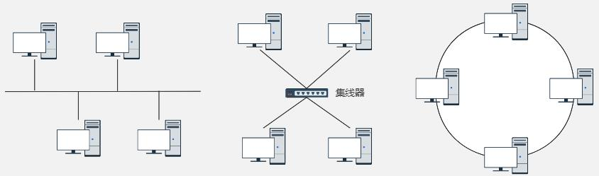
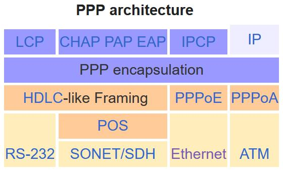
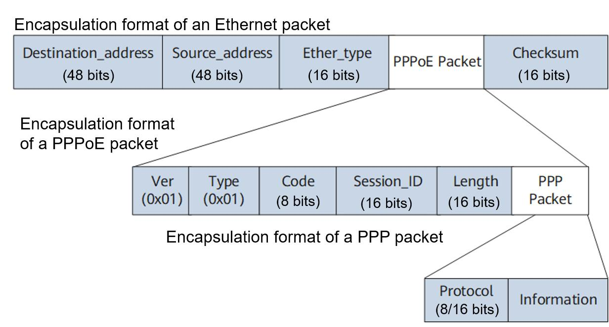

# 数据链路层的基本概念

## 按照网络拓扑分类

###  点对点型（非共享介质）

点对点型链路通常包含以下几种：

* 通过专用介质将两个节点连接
* **基于交换机**的星型网络（注意这个也勉强能归为点对点，虽然一开始建立mac地址表时也包含广播，但广播完之后就是P2P了）


### 广播型（共享介质）

广播型链路由于共享介质的原因，必须要解决**如何共享信道以避免冲突的问题**，即所谓的**[媒体访问控制(media access control)]() **，它通常可以分为三类：

* 信道划分协议
* 随机接入协议
* 轮流协议


广播型链路通常包含以下几种（意味着它们都要有多路访问控制协议）：

* 总线型（基本淘汰）
* **基于集线器**的星型（注意，当两个节点同时往集线器发送帧时，会发生一次碰撞）
* 环型（基本淘汰）





> 无线网络是典型的广播型，但不在这里讨论，会开专门的章节。

## 常见的数据链路层协议

### [Ethernet协议](https://zh.wikipedia.org/wiki/以太网)

> * 以太网是目前应用最普遍的局域网技术，取代了其他局域网标准如[令牌环](https://zh.wikipedia.org/wiki/令牌环)、[FDDI](https://zh.wikipedia.org/wiki/FDDI)和[ARCNET](https://zh.wikipedia.org/w/index.php?title=ARCNET&action=edit&redlink=1)。
> * 以太网的标准[拓扑](https://zh.wikipedia.org/wiki/網絡拓撲)结构为[总线型拓扑](https://zh.wikipedia.org/wiki/匯流排拓撲)，但目前的快速以太网（[100BASE-T](https://zh.wikipedia.org/w/index.php?title=100BASE-T&action=edit&redlink=1)、[1000BASE-T](https://zh.wikipedia.org/wiki/1000BASE-T)标准）为了减少冲突，将能提高的网络速度和使用效率最大化，使用[交换机](https://zh.wikipedia.org/wiki/網路交換器)（Switch hub）来进行网络连接和组织。如此一来，以太网的拓扑结构就成了[星型](https://zh.wikipedia.org/wiki/星型网)；但在逻辑上，以太网仍然使用总线型拓扑和[CSMA/CD](https://zh.wikipedia.org/wiki/CSMA/CD)（Carrier Sense Multiple Access/Collision Detection，即载波多重访问/碰撞侦测）的总线技术。


> Ethernet Ⅱ帧，也称为Ethernet V2帧，是如今局域网里最常见的以太帧，是以太网事实标准。如今大多数的TCP/IP应用（如HTTP、FTP、SMTP、POP3等）都是采用Ethernet II帧承载。
>
> 图2-1  Ethernet Ⅱ帧格式
>
> ```
>          +-----------+-----------+-------------+--------------------+----------+
>          |   DMAC    |   SMAC    |     Type    |          Data      |   FCS    |
>          |  6 Bytes  |  6 Bytes  |   2 Bytes   |  Variable length   | 4 Bytes  |
>          +-----------+-----------+-------------+--------------------+----------+
>          |                                                                     |
>                   |                                                          |
>                             |                                             |
>                                      |                                  |
>                                              |                         |
>                                                     |                 |
>          +-------------+-----------+----------------+-----------------+
>          |   帧间隙     |前同步码     |帧开始定界符      |Ethernet Frame   |
>          |至少12Bytes   | 7 Bytes   |  1 Byte        | Variable length |
>          +-------------+-----------+----------------+-----------------+
> ```
>
> 

1. **Ethernet协议中包含了DMAC和SMAC，反映出这个协议在诞生之初就是面向广播型的（点对点型不需要这些，因为是1v1通讯），这点对理解PPPoE非常重要❗❗❗**。

2. **以太网从总线型，发展为星型（集线器），最终进化为星型（交换机），从广播型变成了点对点型，使得不再需要冲突检测算法，甚至不需要MAC，但帧的格式因为历史原因依然保留了下来**。

3. 虽然后续Ethernet通过交换机进化为星型，但【协议本身为广播型设计】这个特点并没有消失，**它的目的就是让一个局域网内的多台机器能够进行通讯，而点对点只需要负责一对一通讯。**

4. 因此可以猜测，假设a和b分别是两个不同局域网之间的节点，它们因为某种原因想进行PPP通讯的话，a通过广域网将Ethernet的帧发给了b，b提取出Ethernet帧中的PPPoE报文，这样就造成了一种假象：**a和b似乎在通过PPP进行通讯**。那为何不直接通讯呢，个人理解是为了利用PPP生态上的一些资源或者功能。

5. 按照《计算机网络-自顶向下方法》中的结论，当今基于交换机的星型以太网，**已经不再需要MAC地址了**，原因如下：

   1. 不再是广播型网络，交换机能够记住每个端口都连接了谁
   2. 因为1的原因，不会有碰撞，也不会需要把不属于该节点的帧发送给该节点，因此也不需要MAC地址。（仔细想想，交换机完全可以根据端口号来分辨主机，或许MAC真的不是必须了）
   3. 交换机和节点之间的通讯是全双工的，不会有碰撞

   但以太网依然存在，因为它的根本，以太网帧的格式还存在。

   


参考：

* [IP报文格式大全(html)](https://support.huawei.com/enterprise/zh/doc/EDOC1100174722/ea0a043c)


### PPP



参考：

* [https://support.huawei.com/enterprise/zh/doc/EDOC1100174722/a3a1ebd0](https://support.huawei.com/enterprise/zh/doc/EDOC1100174722/a3a1ebd0)
* [Point-to-Point_Protocol](https://en.wikipedia.org/wiki/Point-to-Point_Protocol)

### PPPoE

> #### PPPoE解决了哪些问题？
>
> PPP协议是一种点对点协议，点对点的含义即为一个节点只能访问另一个指定的节点。PPP协议处于OSI（Open Systems  Interconnection）参考模型的第二层，即TCP/IP数据链路层，主要用于全双工的异步链路上进行点到点的数据传输。PPP协议的一个重要功能便是提供了身份验证功能。但是PPP协议虽然提供了通信双方身份验证的功能，其协议中没有提供地址信息，**而以太网是一个广播类型的多路访问网络（非常重要❗❗❗）**，因而PPP协议是无法直接应用在以太网链路上的。
>
> 以太网技术虽然具有简单易用，成本低等特点，但是以太网广播网络的属性，使得其通信双方无法相互验证对方的身份，因而通信是不安全的。
>
> 如何解决以上问题，同时又在现有的网络结构基础上，保证网络的低成本运营？答案便是：PPPoE技术。PPPoE结合了PPP协议通信双方身份验证的功能，在PPP组网结构的基础上，将PPP报文封装成PPPoE报文，从而实现以太网上的点对点通信，**使得以太网中的客户端能够连接到远端的宽带接入设备上**。
>
> #### PPPoE的特点
>
> PPPoE具有以下特点：
>
>    功能上：   
>
> 1. PPPoE由于集成了PPP协议，实现了传统以太网不能提供的身份验证、加密以及压缩等功能。
> 2. PPPoE通过唯一的Session ID可以很好的保障用户的安全性。
>
> 应用上：
>
> 1. PPPoE拨号上网作为一种最常见的方式让终端设备能够连接ISP从而实现宽带接入。
> 2. PPPoE可用于缆线调制解调器（Cable Modem）和数字用户线路（DSL）等以太网线，通过以太网协议向用户提供接入服务的协议体系。
>
> 总而言之，PPPoE技术将以太网技术的经济性与PPP协议的可管理控制性结合在一起，提供接入互联网的功能。对于运营商来说，它能够最大限度地利用电信接入网现有的体系结构，利用现有的拨号网络资源，运营和管理的模式也不需要很大的改变；对于用户来说，使用感与原来的拨号上网没有太大区别，较容易接受。



参考：

* [https://support.huawei.com/enterprise/zh/doc/EDOC1100174722/730b8fde](https://support.huawei.com/enterprise/zh/doc/EDOC1100174722/730b8fde)
* [什么是PPPoE？PPPoE解决了哪些问题？](https://info.support.huawei.com/info-finder/encyclopedia/zh/PPPoE.html)

# 参考

* http://www.highteck.net/EN/DataLink/Data_Link_Layer.html

# 问答

---

**Q**： ppp和以太网（Ethernet）协议都是位于数据链路层的协议，这说明他们的关系是平等的。然而从PPPoE中我们知道，ppp是封装在以太网中的，那么说明ppp是比以太网更高一级的协议，这似乎和我们一开始的结论矛盾？通过查阅一些资料之后，我的理解是Ethernet是真正负责一段链路的数据传输的，而ppp是在链路数据传输已经建立的基础上，提供更多的功能（例如用户认证等），请问这个理解是否正确？（回答不要涉及OSI，因为现实中只使用TCP/IP）

**ChatGPT**：您的理解是正确的。尽管PPP和以太网（Ethernet）都位于数据链路层，但在PPPoE（以太网上的PPP）这个特定的场景中，它们的关系并不是完全平等的。实际上，这种关系更多地是协作和互补，而不是层级关系。

在PPPoE中，Ethernet是负责在物理层和数据链路层之间传输数据的底层协议。它定义了如何在局域网（LAN）或点对点链路上传输数据帧，包括帧结构、寻址、错误检测等。Ethernet提供了链路层的基本服务，如数据帧的封装和解封装、物理介质上的信号传输等。

而PPP是一种数据链路层协议，它提供了在点对点链路上建立连接、传输数据并进行网络层配置的功能。PPP本身并不直接处理物理层的传输细节，而是依赖于底层协议（如Ethernet）来提供这些服务。在PPPoE中，PPP利用Ethernet作为底层传输机制，通过特定的封装技术（即PPPoE封装）将PPP帧封装在Ethernet帧中，以便在Ethernet网络上传输。

因此，可以说Ethernet是负责链路数据传输的底层协议，而PPP则是在链路数据传输已经建立的基础上，提供更多的功能，如用户认证、IP地址分配等。这种关系并不是层级关系，而是协作和互补关系。Ethernet提供了数据传输的基础服务，而PPP则利用这些服务来实现更高级的网络功能。

需要注意的是，虽然PPP和Ethernet在PPPoE中是以这种方式协作的，但在其他场景中，它们可能以不同的方式使用。例如，Ethernet可以单独用于局域网通信，而PPP也可以在其他类型的链路上使用，而不仅仅是基于Ethernet的链路。因此，在具体应用中，需要根据实际需求和网络环境来选择合适的协议。

---


**Q**：PPP是如何实现加密和身份验证的，它只是一个通讯协议，为何能加密和身份验证

**ChatGPT**：PPP（点到点协议）不仅是一个简单的通讯协议，它确实包含了一系列用于建立、维护和终止数据链路层连接的特性。PPP协议支持加密和身份验证，这主要是通过其内置的认证协议来实现的，其中最为常用的是CHAP（挑战握手认证协议）和PAP（密码认证协议）。以下将详细解释PPP如何实现加密和身份验证：

一、身份验证

1. PAP（Password Authentication Protocol，密码认证协议）
   - PAP是一种简单的明文验证方式。在链路首次初始化时，被认证端首先发起认证请求，向认证端发送用户名和密码信息进行身份认证。由于密码口令以明文发送，所以安全性较低，容易被第三方截获和利用。
2. CHAP（Challenge Handshake Authentication Protocol，挑战握手认证协议）
   - CHAP比PAP更安全，它不在网络上发送明文，而是发送经过散列（如MD5）的随机数序列。
   - CHAP通过三次握手验证被认证端的身份：
     - 认证方（如路由器B）首先发起一个挑战，包含一个随机生成的挑战值。
     - 被认证方（如路由器A）用该挑战值和本地密码通过散列函数生成一个响应值，然后将响应值返回给认证方。
     - 认证方用同样的挑战值和自己的密码进行散列运算，如果生成的响应值与收到的响应值相同，则验证成功。
   - CHAP支持单向和双向认证，且为了提高安全性，在链路建立之后可以周期性进行验证。

二、加密

虽然PPP本身并不直接提供加密功能，但它可以与其他加密协议（如MPPE，Microsoft Point-to-Point  Encryption）结合使用，为传输的数据提供加密保护。当PPP与MPPE等加密协议结合使用时，可以在数据链路层对数据进行加密，确保数据在传输过程中的安全性。

总结：PPP通过内置的认证协议（如CHAP）实现了身份验证，而通过与加密协议的结合使用（如MPPE），为数据传输提供了加密保护。这些特性使得PPP成为了一个既安全又灵活的通信协议。

---


